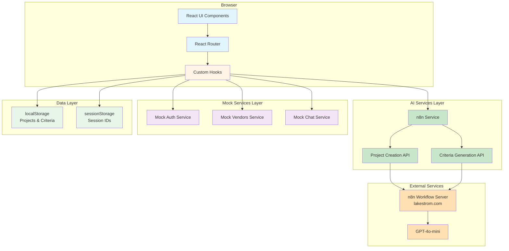
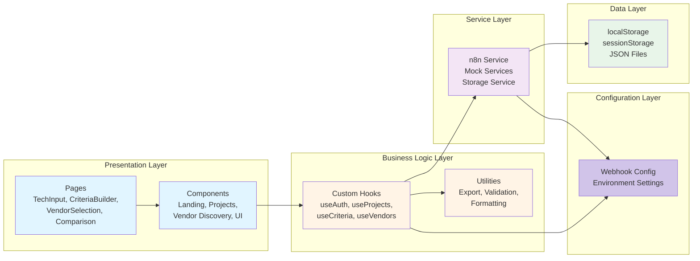
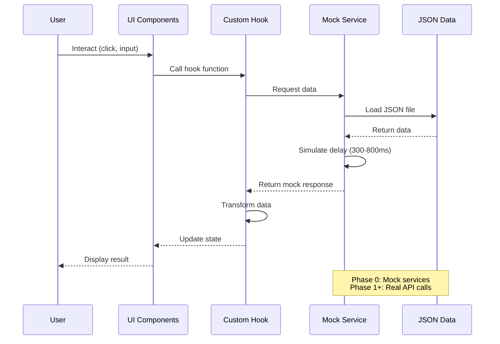
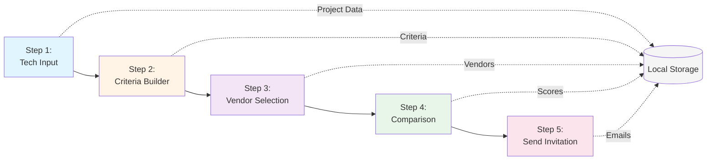
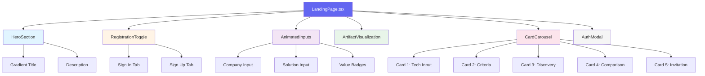
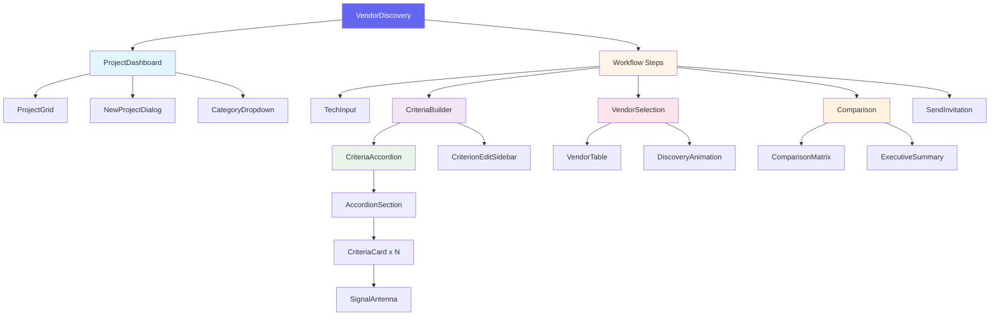
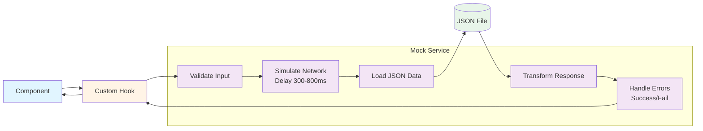
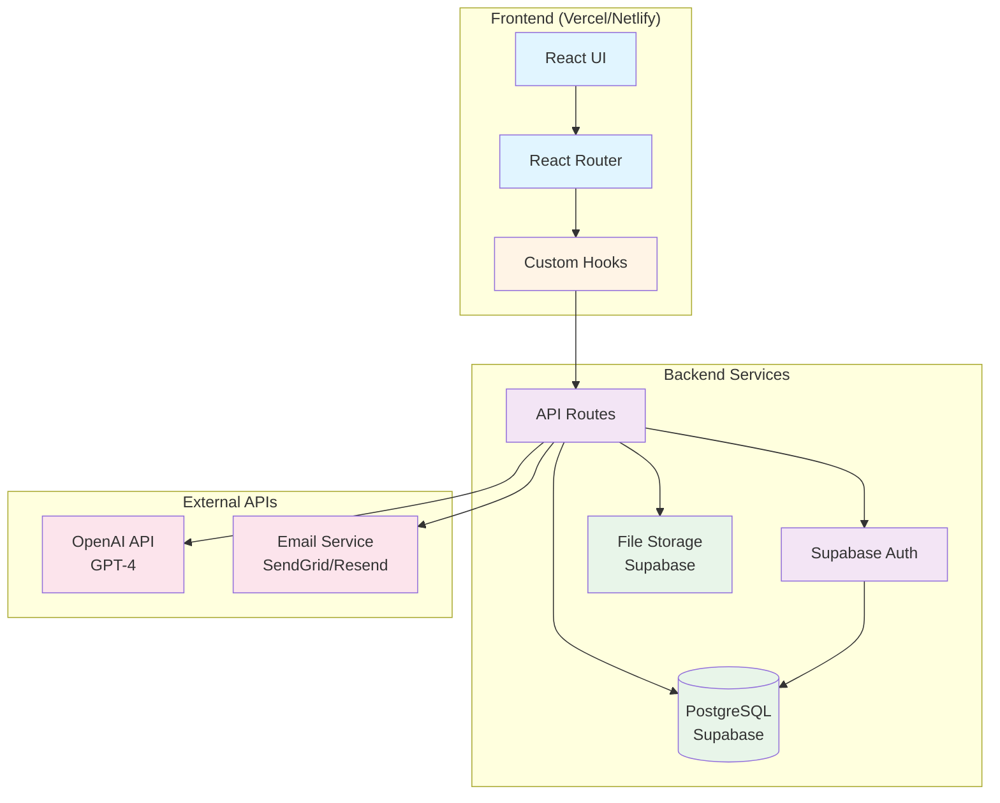

# Clarioo Application Architecture

**Version**: 4.7.0
**Last Updated**: January 17, 2026
**Status**: Phase 1 - n8n AI Integration (SP_030 Complete - Phase 1 Complete)
**Related Docs**: [CODEBASE_STRUCTURE.md](./CODEBASE_STRUCTURE.md), [PROJECT_ROADMAP.md](./PROJECT_ROADMAP.md)

---

## Table of Contents
1. [Executive Summary](#executive-summary)
2. [System Architecture Overview](#system-architecture-overview)
3. [Application Layers](#application-layers)
4. [Data Flow Architecture](#data-flow-architecture)
5. [Component Hierarchy](#component-hierarchy)
6. [n8n AI Integration (Phase 1)](#n8n-ai-integration-phase-1)
7. [Mock Service Architecture](#mock-service-architecture)
8. [Future Production Architecture](#future-production-architecture)

---

## Executive Summary

Clarioo has completed **Phase 1: n8n AI Integration**, with comprehensive real AI processing via n8n webhooks. The architecture now includes:
- **Real AI**: 12 active n8n webhooks with GPT-4o-mini and Perplexity integration
- **Core features**: Project creation, criteria generation, vendor discovery, two-stage comparison, executive summary, vendor summary, email collection, template system (carousel + preview), battlecard generation (10 rows), cell summaries, vendor positioning scatter plot
- **Production-ready**: localStorage persistence, error handling, retry logic, caching strategies, collision detection, image processing
- **Data Export**: Excel (7 tabs) and JSON export with vendor logos and scatter plot screenshots

**Current State**: React application with full n8n AI backend integration (12 active webhooks) - **Phase 1 Complete**
**Next Phase**: Planning for Phase 2 enhancements or future features
**Future State**: Full-stack with Supabase database, authentication, and team collaboration

---

## Technology Stack

### Frontend
- **React**: 18.3.1
- **TypeScript**: 5.5.3
- **Vite**: 5.4.1
- **React Router**: 6.26.2
- **Tailwind CSS**: 3.4.11
- **shadcn/ui**: Radix UI components

### AI Backend
- **n8n**: Self-hosted workflow automation
- **GPT-4o-mini**: OpenAI model (temperature 0.3, max tokens 6000)
- **Perplexity**: AI-powered search and research

### Testing
- **Vitest**: 4.0.8
- **Playwright**: 1.56.1
- **React Testing Library**: Component testing

### Storage
- **localStorage**: Client-side persistence (Phase 1)
- **Supabase**: Planned database (Phase 2+)

---

## System Architecture Overview

### Current Architecture (Phase 1: n8n AI Integration)



**Key Characteristics:**
- ✅ Real AI backend for project creation and criteria generation
- ✅ n8n webhooks with GPT-4o-mini (temperature: 0.3, max tokens: 6000)
- ✅ Mock services for vendor selection and comparison (planned for SP_017/SP_018)
- ✅ localStorage persistence for ephemeral data
- ✅ Full workflow demonstration capabilities

---

## Application Layers

### Layer Architecture (Top to Bottom)



**Layer Responsibilities:**

| Layer | Purpose | Technologies | Files Location |
|-------|---------|--------------|----------------|
| **Presentation** | UI rendering, user interaction | React, shadcn/ui | `/src/components/` |
| **Business Logic** | State management, data transformation | React Hooks, TypeScript | `/src/hooks/`, `/src/utils/` |
| **Configuration** | Environment config, webhook URLs | TypeScript | `/src/config/` |
| **Service** | Data fetching, API calls | n8n service, mock services | `/src/services/` |
| **Data** | Persistence and static data | localStorage, JSON | `/src/data/`

---

## Data Flow Architecture

### User Workflow Data Flow



### 5-Step Vendor Discovery Workflow



**State Persistence:**
- **Local Storage**: Project state, user preferences
- **Session State**: Current step, form inputs, chat history
- **Component State**: UI interactions, animations, modals

---

## Component Hierarchy

### Landing Page Component Tree



### Vendor Discovery Component Tree



---

## n8n AI Integration (Phase 1)

### Overview

As of Sprint 16 (November 23, 2024), Clarioo has transitioned from Phase 0 (Visual Prototype) to Phase 1 (n8n AI Integration). The core project creation and criteria generation now use real AI processing through n8n workflows.

### n8n Webhook Architecture

**n8n Endpoints** (10 active webhooks):

1. **Project Creation**:
   - URL: `https://n8n.lakestrom.com/webhook/clarioo-project-creation`
   - Method: POST
   - Timeout: 120 seconds (2 minutes)
   - Status: ✅ Implemented (SP_016)
   - Function: AI-powered project and criteria generation from company context

2. **Criteria Chat**:
   - URL: `https://n8n.lakestrom.com/webhook/clarioo-criteria-chat`
   - Method: POST
   - Timeout: 120 seconds (2 minutes)
   - Status: ✅ Implemented (SP_016)
   - Function: Natural language criterion refinement and editing

3. **Find Vendors**:
   - URL: `https://n8n.lakestrom.com/webhook/clarioo-find-vendors`
   - Method: POST
   - Timeout: 180 seconds (3 minutes)
   - Status: ✅ Implemented (SP_018)
   - Function: AI-powered vendor discovery with match scoring

4. **Compare Vendors** (Single Vendor Summary):
   - URL: `https://n8n.lakestrom.com/webhook/clarioo-compare-vendors`
   - Method: POST
   - Timeout: 180 seconds (3 minutes)
   - Status: ✅ Implemented (SP_019)
   - Function: Single vendor comprehensive analysis

5. **Compare Vendor Criterion** (Stage 1: Individual Research):
   - URL: `https://n8n.lakestrom.com/webhook/compare-vendor-criterion`
   - Method: POST
   - Timeout: 45 seconds
   - Status: ✅ Implemented (SP_018)
   - Function: Per-cell evidence-based research for vendor-criterion pairs

6. **Rank Criterion Results** (Stage 2: Comparative Ranking):
   - URL: `https://n8n.lakestrom.com/webhook/rank-criterion-results`
   - Method: POST
   - Timeout: 90 seconds
   - Status: ✅ Implemented (SP_018)
   - Function: Cross-vendor comparative ranking with competitive advantage stars

7. **Executive Summary**:
   - URL: `https://n8n.lakestrom.com/webhook/clarioo-executive-summary`
   - Method: POST
   - Timeout: 120 seconds (2 minutes)
   - Status: ✅ Implemented (SP_019)
   - Function: Strategic analysis and vendor recommendations

8. **Vendor Card Summary**:
   - URL: `https://n8n.lakestrom.com/webhook/Vendor-Card-Summary`
   - Method: POST
   - Timeout: 120 seconds (2 minutes)
   - Status: ✅ Implemented (SP_019)
   - Function: Individual vendor killer features and summary generation via Perplexity

9. **Email Collection**:
   - URL: `https://n8n.lakestrom.com/webhook/clarioo-email-collection`
   - Method: POST
   - Timeout: 30 seconds
   - Status: ✅ Implemented (SP_017)
   - Function: User email collection with device metadata to Google Sheets

10. **Battlecard Row**:
   - URL: `https://n8n.lakestrom.com/webhook/battlecard-row`
   - Method: POST
   - Timeout: 60 seconds
   - Status: ✅ Implemented (SP_023)
   - Function: Generate individual battlecard rows for vendor comparison matrix

**AI Configuration** (set within n8n workflows):
- AI Model: GPT-4o-mini
- Temperature: 0.3
- Max Tokens: 6000

**Request Format**:
```json
{
  "user_id": "uuid-v4-from-localStorage",
  "session_id": "uuid-v4-from-sessionStorage",
  "company_context": "User's company description",
  "solution_requirements": "What solution they're looking for",
  "timestamp": "2024-11-23T10:00:00.000Z"
}
```

**Response Format**:
```json
{
  "success": true,
  "project": {
    "name": "AI-Generated Project Name",
    "description": "Detailed description",
    "category": "Software Category"
  },
  "criteria": [
    {
      "id": "crit_001",
      "name": "Criterion Name",
      "description": "Detailed explanation",
      "importance": "high|medium|low",
      "type": "feature|technical|business|compliance",
      "isArchived": false
    }
  ]
}
```

### Integration Components

**Configuration Layer** (`src/config/webhooks.ts`):
- `getWebhookMode()` - Returns current mode (production | testing)
- `setWebhookMode()` - Sets webhook mode in localStorage
- `getProjectCreationUrl()` - Get project creation webhook URL
- `getCriteriaChatUrl()` - Get criteria chat webhook URL
- `getFindVendorsUrl()` - Get find vendors webhook URL
- `getCompareVendorsUrl()` - Get compare vendors webhook URL
- `getExecutiveSummaryUrl()` - Get executive summary webhook URL
- `getEmailCollectionUrl()` - Get email collection webhook URL
- **Dual Mode Support**: Production and testing webhook URLs for all endpoints
- **Persistence**: Mode selection persists in localStorage (`clarioo_webhook_mode`)

**Service Layer** (`src/services/n8nService.ts`):
- `createProjectWithAI()` - Main API client function
- `getUserId()` - Persistent user ID from localStorage
- `getSessionId()` - Session ID from sessionStorage
- `transformN8nCriterion()` - Maps n8n response to app format
- `transformN8nProject()` - Maps n8n project to app format
- `collectEmail()` - Email collection with device metadata
- `retryEmailCollection()` - Silent retry for failed submissions

**React Hooks**:
- `useProjectCreation.ts` - Wrapper for n8n project creation API
- `useWebhookMode.ts` - Webhook mode state management
- Loading states and error handling
- localStorage persistence
- Navigation integration

**Type Definitions** (`src/types/n8n.types.ts`):
- `N8nProjectCreationRequest` - Request interface
- `N8nProjectCreationResponse` - Response interface
- `N8nCriterion` - Criterion format from n8n
- `EmailCollectionRequest` - Email collection interface
- `DeviceMetadata` - Device information interface
- Type mappings to existing app types

**Utilities** (`src/utils/deviceMetadata.ts`):
- `getDeviceMetadata()` - Collect browser, OS, device type, resolution, timezone
- Browser detection (Chrome, Firefox, Safari, Edge, etc.)
- OS detection (Windows, macOS, iOS, Android, Linux)
- Device type classification (mobile, tablet, desktop)

### Data Flow

1. User enters company context and solution requirements in landing page
2. "Create with AI" button triggers `useProjectCreation` hook
3. Hook calls `createProjectWithAI()` with user inputs
4. n8n service sends POST request to webhook with user_id and session_id
5. n8n workflow:
   - Receives request
   - Calls GPT-4o-mini with structured prompt
   - Parses AI response
   - Validates and formats output
   - Returns project + 10-15 criteria
6. App transforms n8n response to internal format
7. Data saved to localStorage
8. User navigated to vendor discovery workflow with pre-generated criteria

### Error Handling

| Error Type | Handling |
|------------|----------|
| Network failure | Toast notification, retry option |
| Timeout (120-180s) | "AI processing took too long" message |
| Invalid input | Form validation (min 10 characters) |
| AI processing error | User-friendly error message, retry |
| Invalid response | Logged error, fallback to mock service |

### Storage Strategy (Phase 1)

**localStorage** (persistent across sessions):
- `clarioo_user_id` - UUID for user tracking
- `clarioo_projects` - Array of all user projects
- `criteria_${projectId}` - Criteria for each project
- `workflow_${projectId}` - Workflow state per project
- `clarioo_webhook_mode` - Webhook mode (production | testing)
- `email_submitted` - Flag to prevent duplicate email collection modal
- `email_passed_to_n8n` - Flag for silent retry of failed email submissions
- `clarioo_executive_summary_${projectId}` - Cached executive summaries
- `clarioo_vendor_summary_${projectId}_${vendor}` - Cached vendor summaries
- `comparison_${projectId}_${vendor}_${criterion}` - Stage 1 comparison cache
- `ranking_${projectId}_${criterion}` - Stage 2 ranking cache

**sessionStorage** (per browser tab):
- `clarioo_session_id` - UUID for session tracking

---

## Two-Stage Progressive Comparison System (SP_018)

### Overview

The two-stage comparison system provides sophisticated vendor analysis through progressive enhancement:

**Stage 1: Individual Research** - Per-cell evidence-based analysis
- Each vendor-criterion pair analyzed independently
- Evidence collection with source citations
- Strength assessment (yes/unknown/no) with confidence levels
- 45-second timeout per cell with retry capability
- localStorage caching to prevent redundant API calls

**Stage 2: Comparative Ranking** - Cross-vendor competitive analysis
- Comparative ranking across all vendors for each criterion
- Competitive advantage stars (0-5 stars) awarded to leaders
- Relative strength analysis with explanatory evidence
- 90-second timeout per criterion with retry capability
- Cache invalidation when comparison data changes

### Architecture Components

**Service Layer** (`src/services/n8nService.ts`):
- `compareVendorCriterion()` - Stage 1: Individual vendor-criterion research
- `rankCriterionResults()` - Stage 2: Cross-vendor comparative ranking
- Request/response formatting for n8n webhooks
- Error handling with automatic retry logic

**Hooks Layer** (`src/hooks/useTwoStageComparison.ts`):
- Progressive comparison state management
- Cell-level loading states (pending/loading/yes/no/unknown/star/failed)
- Automatic stage progression (Stage 1 → Stage 2)
- Error recovery and retry coordination

**Storage Layer** (`src/utils/comparisonStorage.ts`):
- Cache management for Stage 1 and Stage 2 results
- Automatic cache invalidation on data changes
- Performance optimization through intelligent caching
- Storage key generation and retrieval

**Component Layer** (`src/components/VendorComparisonNew.tsx`):
- Two-stage UI with visual feedback
- Cell-level state visualization
- Interactive evidence display
- Stage progression indicators

### Data Flow

**Stage 1 Flow**:
1. User initiates comparison for specific vendor-criterion pairs
2. Component triggers `compareVendorCriterion()` with project context
3. n8n webhook performs AI-powered research (GPT-4o-mini + Perplexity)
4. Response includes: strength (yes/unknown/no), evidence, sources
5. Result cached in localStorage with unique key
6. UI updates cell state and displays evidence

**Stage 2 Flow**:
1. After Stage 1 completes for all vendors on a criterion
2. Component triggers `rankCriterionResults()` with all Stage 1 results
3. n8n webhook performs comparative analysis across vendors
4. Response includes: competitive rankings, star awards (0-5), relative strengths
5. Result cached in localStorage
6. UI updates cells with star indicators and comparative insights

### Cell State Management

**Possible States**:
- `pending` - Cell awaiting Stage 1 research
- `loading` - API call in progress
- `yes` - Vendor meets criterion (Stage 1 complete)
- `no` - Vendor does not meet criterion (Stage 1 complete)
- `unknown` - Insufficient information (Stage 1 complete)
- `star` - Competitive advantage awarded (Stage 2 complete)
- `failed` - API call failed, retry available

**State Transitions**:
```
pending → loading → (yes/no/unknown) → loading → star
                 ↓
               failed → pending (retry)
```

### Caching Strategy

**Cache Keys**:
- Stage 1: `comparison_${projectId}_${vendorName}_${criterionId}`
- Stage 2: `ranking_${projectId}_${criterionId}`

**Cache Invalidation**:
- Criteria changes (importance, description) invalidate Stage 1
- Vendor changes invalidate both Stage 1 and Stage 2
- Manual refresh clears all caches
- 24-hour automatic expiration (configurable)

**Performance Benefits**:
- Eliminates redundant API calls
- Instant load on page refresh
- Reduced n8n webhook usage
- Improved user experience

### Error Handling

**Stage 1 Errors**:
- Network timeout: Mark cell as `failed`, allow retry
- Invalid response: Log error, show user-friendly message
- Partial failure: Continue with remaining cells

**Stage 2 Errors**:
- Network timeout: Retry automatically once
- Invalid response: Fall back to Stage 1 results
- Degraded experience: Show Stage 1 without comparative stars

**Retry Logic**:
- Automatic single retry for Stage 2 failures
- Manual retry button for persistent Stage 1 failures
- Exponential backoff for rate limiting
- Clear error messages with actionable guidance

---

## Mock Service Architecture

### Mock Service Pattern

All mock services follow a consistent pattern for realistic API simulation:



**Mock Service Features:**
- ✅ Realistic delays (300-800ms random)
- ✅ Success/error simulation (95% success rate)
- ✅ Input validation
- ✅ Proper error messages
- ✅ Stateful responses (localStorage integration)

**Real Services (n8n Integration):**
- `n8nService.ts` - Real AI via n8n webhooks with 4 endpoints:
  - Project Creation: `clarioo-project-creation` (120s timeout)
  - Criteria Chat: `clarioo-criteria-chat` (120s timeout)
  - Find Vendors: `clarioo-find-vendors` (180s timeout)
  - Email Collection: `clarioo-email-collection` (30s timeout)
  - AI Model: GPT-4o-mini (temperature: 0.3, max tokens: 6000)
  - Storage: localStorage persistence with user_id and session_id tracking

**Mock Services (remaining features):**
- `authService.ts` - Authentication (login, signup, session) - mock
- `projectService.ts` - Project CRUD operations - mock
- `aiService.ts` - AI responses for vendor discovery - mock (until SP_017)
- `dataService.ts` - Data loading from JSON files

**Custom Hooks:**
- `useProjectCreation.ts` - n8n AI-powered project creation with loading/error states
- `useVendorDiscovery.ts` - Vendor discovery workflow state
- `useCriteriaGeneration.ts` - Criteria generation logic
- `useCriteriaChat.ts` - Criterion editing chat
- `useExecutiveSummary.ts` - Summary generation
- `useAuth.tsx` - Authentication state

**Types (n8n Integration):**
- `n8n.types.ts` - N8nProjectCreationRequest/Response, TransformedProject, TransformedCriterion

---

## Future Production Architecture

### Target Architecture (Phase 1+)



### Migration Path

**Phase 0 → Phase 1 Migration Steps:**

1. **Database Setup**
   - Create Supabase project
   - Run schema migrations
   - Set up Row Level Security (RLS) policies
   - Migrate JSON data to PostgreSQL

2. **Service Layer Migration**
   - Replace mock services with real API clients
   - Implement error handling and retry logic
   - Add request caching and optimization
   - Set up API rate limiting

3. **Authentication Migration**
   - Enable Supabase Auth
   - Configure OAuth providers
   - Implement session management
   - Add security headers

4. **AI Integration**
   - Connect OpenAI API
   - Implement prompt engineering
   - Add response streaming
   - Set up usage monitoring

5. **Testing & Deployment**
   - E2E tests for critical flows
   - Performance testing
   - Security audit
   - CI/CD pipeline setup

**Preserved from Prototype:**
- ✅ Component structure
- ✅ Custom hooks interface
- ✅ UI/UX design
- ✅ State management patterns
- ✅ Type definitions

**Changed in Production:**
- ❌ Mock services → Real API clients
- ❌ JSON files → PostgreSQL database
- ❌ Local storage → Supabase backend
- ❌ Simulated delays → Real network latency
- ❌ Dummy data → User-generated content

---

## Architecture Principles

### Design Principles

1. **Separation of Concerns**
   - Clear boundaries between layers
   - Each layer has single responsibility
   - No cross-layer dependencies

2. **Component Reusability**
   - Small, focused components
   - Composition over inheritance
   - Shared UI components in `/components/ui/`

3. **Type Safety**
   - TypeScript strict mode enabled
   - Centralized type definitions in `/src/types/`
   - No `any` types in production code

4. **Mock Service Parity**
   - Mock services mirror real API behavior
   - Same interfaces as production services
   - Easy switch between mock and real

5. **Mobile-First Design**
   - Responsive at all breakpoints (350px - 1920px)
   - Touch-friendly interactions
   - Performance optimized for mobile

### Performance Optimization

- **Code Splitting**: React.lazy for route-based splitting
- **Bundle Size**: Tree shaking, no unused dependencies
- **Rendering**: React.memo for expensive components
- **State**: Local state preferred over global
- **Caching**: Browser caching for static assets

---

## References

- **Codebase Structure**: [CODEBASE_STRUCTURE.md](./CODEBASE_STRUCTURE.md) - Detailed file organization
- **Project Roadmap**: [PROJECT_ROADMAP.md](./PROJECT_ROADMAP.md) - Implementation timeline
- **Development Guidelines**: [GL-RDD.md](./GL-RDD.md), [GL-TDD.md](./GL-TDD.md) - Best practices
- **Feature List**: [../00_PLAN/FEATURE_LIST.md](../00_PLAN/FEATURE_LIST.md) - Feature inventory
- **User Stories**: [../00_PLAN/USER_STORIES.md](../00_PLAN/USER_STORIES.md) - User requirements

---

*This architecture document provides a high-level overview. See CODEBASE_STRUCTURE.md for detailed implementation specifics.*
