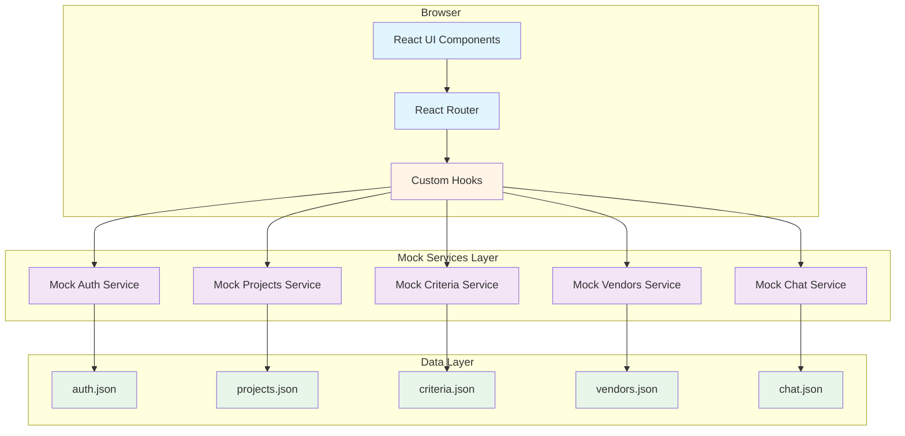
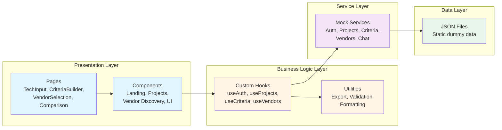
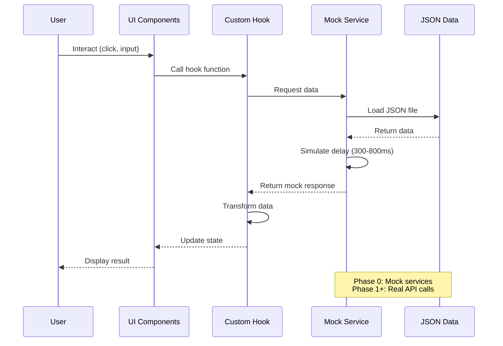
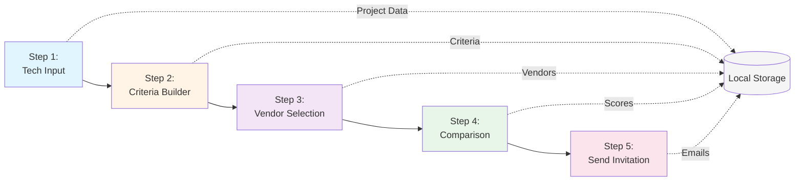
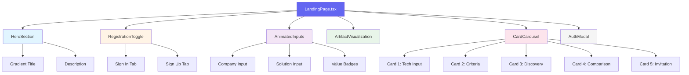
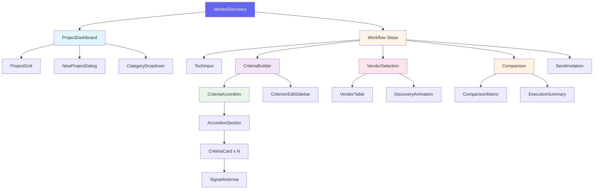
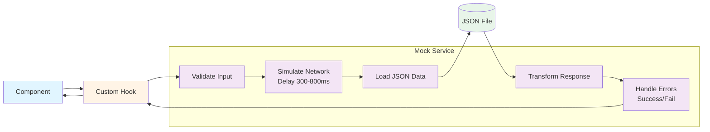
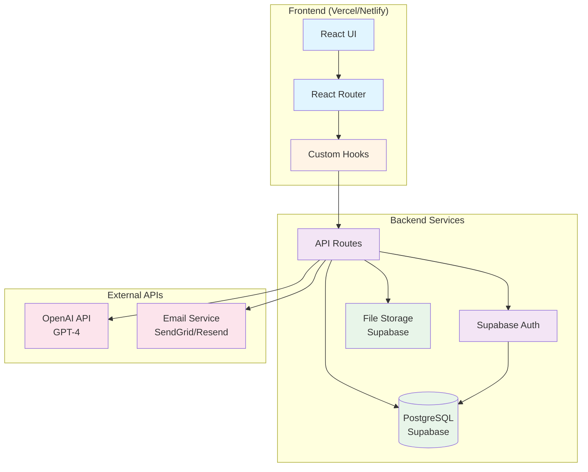

# Clarioo Application Architecture

**Version**: 1.0
**Last Updated**: November 15, 2024
**Status**: Visual Prototype Phase
**Related Docs**: [CODEBASE_STRUCTURE.md](./CODEBASE_STRUCTURE.md), [PROJECT_ROADMAP.md](./PROJECT_ROADMAP.md)

---

## Table of Contents
1. [Executive Summary](#executive-summary)
2. [System Architecture Overview](#system-architecture-overview)
3. [Application Layers](#application-layers)
4. [Data Flow Architecture](#data-flow-architecture)
5. [Component Hierarchy](#component-hierarchy)
6. [Mock Service Architecture](#mock-service-architecture)
7. [Future Production Architecture](#future-production-architecture)

---

## Executive Summary

Clarioo is currently in **Phase 0: Visual Prototype**, using a simplified architecture with mock services and JSON data. The architecture is designed for:
- **Rapid iteration**: Visual verification without backend dependencies
- **Stakeholder feedback**: Fully functional UI demonstrating all workflows
- **Future migration**: Clean separation of concerns enables smooth transition to production

**Current State**: Single-page React application with mock services
**Target State**: Full-stack application with Supabase backend and OpenAI integration

---

## System Architecture Overview

### Current Architecture (Phase 0: Visual Prototype)

**Key Characteristics:**
- ✅ No backend dependencies (100% frontend)
- ✅ Mock services simulate real API behavior
- ✅ Instant responses with realistic delays
- ✅ Full workflow demonstration capabilities
- ✅ Easy to modify test data

---

## Application Layers

### Layer Architecture (Top to Bottom)

**Layer Responsibilities:**

| Layer | Purpose | Technologies | Files Location |
|-------|---------|--------------|----------------|
| **Presentation** | UI rendering, user interaction | React, shadcn/ui | `/src/pages/`, `/src/components/` |
| **Business Logic** | State management, data transformation | React Hooks, TypeScript | `/src/hooks/`, `/src/utils/` |
| **Service** | Data fetching, API simulation | Mock services | `/src/services/mock/` |
| **Data** | Static data storage | JSON files | `/src/data/api/` |

---

## Data Flow Architecture

### User Workflow Data Flow

### 5-Step Vendor Discovery Workflow

**State Persistence:**
- **Local Storage**: Project state, user preferences
- **Session State**: Current step, form inputs, chat history
- **Component State**: UI interactions, animations, modals

---

## Component Hierarchy

### Landing Page Component Tree

### Vendor Discovery Component Tree

---

## Mock Service Architecture

### Mock Service Pattern

All mock services follow a consistent pattern for realistic API simulation:

**Mock Service Features:**
- ✅ Realistic delays (300-800ms random)
- ✅ Success/error simulation (95% success rate)
- ✅ Input validation
- ✅ Proper error messages
- ✅ Stateful responses (localStorage integration)

**Available Mock Services:**
- `authService.ts` - Authentication (login, signup, session)
- `projectService.ts` - Project CRUD operations
- `aiService.ts` - AI responses for criteria and vendor discovery
- `dataService.ts` - Data loading from JSON files

**Custom Hooks:**
- `useVendorDiscovery.ts` - Vendor discovery workflow state
- `useCriteriaGeneration.ts` - Criteria generation logic
- `useCriteriaChat.ts` - Criterion editing chat
- `useExecutiveSummary.ts` - Summary generation
- `useAuth.tsx` - Authentication state

---

## Future Production Architecture

### Target Architecture (Phase 1+)

### Migration Path

**Phase 0 → Phase 1 Migration Steps:**

1. **Database Setup**
   - Create Supabase project
   - Run schema migrations
   - Set up Row Level Security (RLS) policies
   - Migrate JSON data to PostgreSQL

2. **Service Layer Migration**
   - Replace mock services with real API clients
   - Implement error handling and retry logic
   - Add request caching and optimization
   - Set up API rate limiting

3. **Authentication Migration**
   - Enable Supabase Auth
   - Configure OAuth providers
   - Implement session management
   - Add security headers

4. **AI Integration**
   - Connect OpenAI API
   - Implement prompt engineering
   - Add response streaming
   - Set up usage monitoring

5. **Testing & Deployment**
   - E2E tests for critical flows
   - Performance testing
   - Security audit
   - CI/CD pipeline setup

**Preserved from Prototype:**
- ✅ Component structure
- ✅ Custom hooks interface
- ✅ UI/UX design
- ✅ State management patterns
- ✅ Type definitions

**Changed in Production:**
- ❌ Mock services → Real API clients
- ❌ JSON files → PostgreSQL database
- ❌ Local storage → Supabase backend
- ❌ Simulated delays → Real network latency
- ❌ Dummy data → User-generated content

---

## Architecture Principles

### Design Principles

1. **Separation of Concerns**
   - Clear boundaries between layers
   - Each layer has single responsibility
   - No cross-layer dependencies

2. **Component Reusability**
   - Small, focused components
   - Composition over inheritance
   - Shared UI components in `/components/ui/`

3. **Type Safety**
   - TypeScript strict mode enabled
   - Centralized type definitions in `/src/types/`
   - No `any` types in production code

4. **Mock Service Parity**
   - Mock services mirror real API behavior
   - Same interfaces as production services
   - Easy switch between mock and real

5. **Mobile-First Design**
   - Responsive at all breakpoints (350px - 1920px)
   - Touch-friendly interactions
   - Performance optimized for mobile

### Performance Optimization

- **Code Splitting**: React.lazy for route-based splitting
- **Bundle Size**: Tree shaking, no unused dependencies
- **Rendering**: React.memo for expensive components
- **State**: Local state preferred over global
- **Caching**: Browser caching for static assets

---

## References

- **Codebase Structure**: [CODEBASE_STRUCTURE.md](./CODEBASE_STRUCTURE.md) - Detailed file organization
- **Project Roadmap**: [PROJECT_ROADMAP.md](./PROJECT_ROADMAP.md) - Implementation timeline
- **Development Guidelines**: [GL-RDD.md](./GL-RDD.md), [GL-TDD.md](./GL-TDD.md) - Best practices
- **Feature List**: [../00_PLAN/FEATURE_LIST.md](../00_PLAN/FEATURE_LIST.md) - Feature inventory
- **User Stories**: [../00_PLAN/USER_STORIES.md](../00_PLAN/USER_STORIES.md) - User requirements

---

*This architecture document provides a high-level overview. See CODEBASE_STRUCTURE.md for detailed implementation specifics.*
