# Sprint Plan: Project Templates Feature

## Sprint Information
**Sprint ID:** SP_021_Project_Templates_Feature
**Duration:** 2 days
**Start Date:** 2024-12-04
**End Date:** 2024-12-05
**Type:** Feature Implementation + Testing

## Sprint Goal
Implement project templates feature that allows users to quick-start projects from pre-configured industry templates with ready-made evaluation criteria, following GL-RDD.md (README-Driven Development) and GL-TDD.md (Test-Driven Development) principles.

## Scope

### User Stories to Complete
- **US-12.3:** Community Templates Gallery (Epic 12: Community & Viral Features)

### Features to Implement
- **F-034:** Project Templates System (5 points)
  - [ ] Templates button on landing page
  - [ ] Templates modal with category filters
  - [ ] Template cards grid (3 columns desktop, 1 column mobile)
  - [ ] Criteria preview modal (read-only view)
  - [ ] Template-based project creation
  - [ ] Integration with existing workflow

## Technical Approach

### Architecture (Following GL-RDD.md)

**Layer 1: Data Layer**
```
src/data/templates/
├── templates.json          # Template definitions
└── README.md              # Templates data structure documentation
```

**Layer 2: Service Layer**
```
src/services/
└── templateService.ts     # Template CRUD operations
```

**Layer 3: Presentation Layer**
```
src/components/templates/
├── TemplatesModal.tsx           # Main templates modal
├── CategoryFilter.tsx           # Category filter tags
├── TemplateCard.tsx             # Individual template card
├── CriteriaPreviewModal.tsx     # Read-only criteria view
└── README.md                    # Components documentation
```

**Layer 4: Integration Layer**
```
src/components/landing/
└── LandingPage.tsx        # Add Templates button (updated)
```

### Component Hierarchy

```
LandingPage
└── Templates Button
    └── TemplatesModal (Dialog)
        ├── Close Button (X)
        ├── CategoryFilter
        │   ├── All (default, mutually exclusive)
        │   ├── CX Platform
        │   ├── Project Management
        │   ├── CRM
        │   ├── ERP
        │   └── ATS & Recruiting
        ├── TemplateCard[] (grid)
        │   └── CriteriaPreviewModal (on click)
        │       ├── Criteria Accordion (read-only)
        │       │   ├── AccordionSection (reused)
        │       │   └── CriteriaCard (disabled)
        │       ├── Download/Share Button
        │       │   └── ShareDialog (reused)
        │       └── Use These Criteria Button
        │           └── Creates Project + Navigates
```

### Data Flow

```mermaid
graph LR
    A[User clicks Templates] --> B[TemplatesModal opens]
    B --> C[Load templates.json]
    C --> D[Display filtered cards]
    D --> E[User clicks template card]
    E --> F[CriteriaPreviewModal opens]
    F --> G{User action}
    G -->|Download/Share| H[ShareDialog]
    G -->|Use Criteria| I[Create Project]
    I --> J[Check email submission]
    J -->|Not submitted| K[Show EmailCollectionModal]
    J -->|Submitted| L[Skip email modal]
    K --> M[Create project in localStorage]
    L --> M
    M --> N[Navigate to CriteriaBuilder]
    N --> O[Load template criteria]
    O --> P[User continues workflow]
```



## Testing Strategy (Following GL-TDD.md)

### Test-Driven Development Approach

**Phase 1: E2E Tests (Playwright) - PRIORITY 1**

Test file: `test/e2e/tests/template-workflow.spec.ts`

**Test scenarios:**
1. **Happy Path - Complete Template Workflow**
   - Open templates modal
   - Filter by category
   - Select template card
   - View criteria preview
   - Create project from template
   - Verify navigation to CriteriaBuilder
   - Verify criteria loaded correctly

2. **Error Handling**
   - No templates available
   - Failed project creation
   - Network errors (template loading)

3. **Edge Cases**
   - Empty category filter
   - Template with no criteria
   - Browser back/forward navigation

4. **Cross-browser** (Chrome, Firefox, Safari)
   - Responsive design (350px - 1920px)
   - Touch interactions on mobile

**Phase 2: Component Tests (Vitest + React Testing Library)**

Test files:
- `test/unit/components/templates/TemplatesModal.test.tsx`
- `test/unit/components/templates/CategoryFilter.test.tsx`
- `test/unit/components/templates/TemplateCard.test.tsx`
- `test/unit/components/templates/CriteriaPreviewModal.test.tsx`

**Phase 3: Service Tests (Vitest)**

Test file: `test/unit/services/templateService.test.ts`

**Test coverage targets:**
- E2E: 100% of user flows
- Component: 80%+ coverage
- Service: 95%+ coverage (GL-TDD.md requirement for utilities)

## Implementation Plan (TDD Workflow)

### Day 1: Foundation + Core Components

**Morning (RED → GREEN → REFACTOR)**

1. **Write E2E test for templates modal** (RED)
   ```typescript
   test('should open templates modal and display templates', async ({ page }) => {
     // Test fails - modal doesn't exist yet
   });
   ```

2. **Create templates.json data structure** (GREEN)
   - Already complete ✅

3. **Create TemplatesModal component** (GREEN - minimal)
   - Basic structure
   - Opens/closes
   - Pass test

4. **Refactor TemplatesModal** (REFACTOR)
   - Add styling
   - Add animations
   - Clean up code

**Afternoon**

5. **Write test for category filtering** (RED)

6. **Implement CategoryFilter component** (GREEN)

7. **Write test for template cards** (RED)

8. **Implement TemplateCard component** (GREEN)

9. **Refactor components** (REFACTOR)
   - Extract reusable hooks
   - Optimize rendering
   - Add error boundaries

### Day 2: Integration + Testing

**Morning**

10. **Write test for criteria preview** (RED)

11. **Implement CriteriaPreviewModal** (GREEN)
    - Reuse AccordionSection
    - Reuse ShareDialog
    - Add "Use Criteria" button

12. **Write test for project creation** (RED)

13. **Implement template project creation** (GREEN)
    - Skip n8n webhook
    - Save to localStorage
    - Navigate to CriteriaBuilder

**Afternoon**

14. **Integration testing**
    - Run full E2E suite
    - Test on local server
    - Verify all user flows

15. **Refactoring & optimization**
    - Code cleanup
    - Performance optimization
    - Documentation updates

## Component Specifications

### 1. Templates Button (LandingPage.tsx)

**Location:** Same row as "Experts" button
**Icon:** `<Clipboard>` from lucide-react
**Styling:** Identical to Experts button (gradient, hover effects)
**Visibility:** Both authenticated and non-authenticated users

**Implementation:**
```typescript
<Button
  onClick={() => setTemplatesModalOpen(true)}
  className="gradient-button hover:scale-105 transition-transform"
>
  <Clipboard className="w-5 h-5 mr-2" />
  Templates
</Button>
```

### 2. TemplatesModal Component

**Props:**
```typescript
interface TemplatesModalProps {
  isOpen: boolean;
  onClose: () => void;
}
```

**Features:**
- Full viewport size (matches ExecutiveSummaryDialog)
- Click outside to close
- Close button (X) in top-right
- Responsive grid: 3 columns (desktop) / 1 column (mobile)

**Layout:**
```
┌─────────────────────────────────────┐
│ Or start from a template         [X]│
│ Common scenarios with pre-configured│
│                                      │
│ [All] [CX Platform] [CRM] [ERP]...  │
│                                      │
│ ┌────────┐ ┌────────┐ ┌────────┐   │
│ │Template│ │Template│ │Template│   │
│ │Card 1  │ │Card 2  │ │Card 3  │   │
│ └────────┘ └────────┘ └────────┘   │
└─────────────────────────────────────┘
```

### 3. CategoryFilter Component

**Props:**
```typescript
interface CategoryFilterProps {
  categories: string[];
  selectedCategories: string[];
  onCategoryChange: (categories: string[]) => void;
}
```

**Behavior:**
- "All" tag selected by default
- "All" is mutually exclusive with other tags
- Multiple categories selectable (except "All")
- Active tag styling: filled background, border
- Inactive tag styling: outline only

**Categories (from image):**
- All (default)
- CX Platform
- Project Management
- CRM
- ERP
- ATS & Recruiting
- Customer Support
- AI Meeting Assistant

### 4. TemplateCard Component

**Props:**
```typescript
interface TemplateCardProps {
  template: Template;
  onClick: () => void;
}

interface Template {
  id: string;
  category: string;
  name: string;
  metadata?: string;
  currentSolution?: string;
  painPoints?: string;
  lookingFor: string;
  criteria: Criterion[];
}
```

**Layout:**
```
┌────────────────────────┐
│▌ CX PLATFORM           │ ← Colored left border (category color)
│▌                       │
│▌ Luxury Fashion Retailer│ ← name (large, bold)
│▌ 30+ boutiques • E-commerce • Europe │ ← metadata (gray)
│▌                       │
│▌ • Currently: Not clearly specified │ ← currentSolution (optional)
│▌                       │
│▌ "Our tools don't give...│ ← painPoints (quote, optional)
│▌                       │
│▌ Looking for: Advanced...│ ← lookingFor (gray)
│▌                       │
│▌ Use template       ➜  │ ← Button
└────────────────────────┘
```

**Hover effect:**
- Scale: 1.02
- Shadow: elevated-combined
- Border glow

**Category colors:**
- CX Platform: #10b981 (green)
- Project Management: #3b82f6 (blue)
- CRM: #8b5cf6 (purple)
- ERP: #f59e0b (orange)
- ATS & Recruiting: #ef4444 (red)
- (Random assignment for others)

### 5. CriteriaPreviewModal Component

**Props:**
```typescript
interface CriteriaPreviewModalProps {
  isOpen: boolean;
  onClose: () => void;
  template: Template;
  onUseTemplate: () => void;
}
```

**Features:**
- Full viewport size
- Read-only accordion view (reuse AccordionSection)
- Criteria grouped by category
- SignalAntenna visible but not interactive
- No drag-and-drop, no swipe gestures
- Click criterion to view full explanation (expand)

**Buttons:**
```
┌─────────────────────────────┐
│ [Download or Share ▼]       │ ← Opens ShareDialog
│                             │
│ [Use These Criteria to      │ ← Primary action button
│  Start a Project]           │ ← Gradient, large
└─────────────────────────────┘
```

## localStorage Integration

### Template Project Creation

**Storage keys:**
```typescript
// User tracking (existing)
clarioo_user_id: string              // UUID
clarioo_session_id: string           // UUID (session)

// Email (existing)
clarioo_email: {
  email: string;
  email_submitted: boolean;
  email_passed_to_n8n: boolean;
}

// New project from template
clarioo_projects: Project[]          // Append new project
criteria_{projectId}: Criterion[]    // Save template criteria
workflow_{projectId}: {              // Set workflow state
  currentStep: 'criteria-builder'
}
```

### Project Creation Logic

```typescript
function createProjectFromTemplate(template: Template) {
  // 1. Check email submission
  const needsEmail = !hasSubmittedEmail();

  if (needsEmail) {
    // Show EmailCollectionModal
    setEmailModalOpen(true);
    // Wait for submission, then continue
    return;
  }

  // 2. Generate project ID
  const projectId = generateId();

  // 3. Create project object
  const project = {
    id: projectId,
    name: template.name,  // Use template name as project name
    description: template.name,
    category: template.category,
    status: 'draft',
    createdAt: new Date().toISOString(),
    updatedAt: new Date().toISOString(),
    workflow_state: {
      currentStep: 'criteria-builder'
    }
  };

  // 4. Save to localStorage
  const projects = getProjects();
  projects.push(project);
  saveProjects(projects);

  // 5. Save criteria
  saveCriteria(projectId, template.criteria);

  // 6. Navigate to CriteriaBuilder
  navigate(`/vendor-discovery?project=${projectId}&step=criteria-builder`);

  // 7. Show success toast
  toast({
    title: "Project created from template",
    description: `${template.name} with ${template.criteria.length} criteria loaded`,
    duration: 3000
  });
}
```

## Success Criteria

### Functional Requirements
- [x] Templates button appears on landing page
- [ ] Templates modal opens/closes correctly
- [ ] Category filtering works (All + multiple selection)
- [ ] Template cards display correctly (3 cols desktop, 1 col mobile)
- [ ] Criteria preview modal shows read-only view
- [ ] Download/Share functionality works (reuses ShareDialog)
- [ ] "Use These Criteria" creates project correctly
- [ ] Email modal appears if email not submitted
- [ ] Navigation to CriteriaBuilder works
- [ ] Template criteria load in CriteriaBuilder
- [ ] User can continue workflow normally

### Quality Gates (GL-TDD.md Compliance)
- [ ] All E2E tests passing (100% of user flows)
- [ ] Component tests passing (80%+ coverage)
- [ ] Service tests passing (95%+ coverage)
- [ ] No console errors during test runs
- [ ] Cross-browser testing passed (Chrome, Firefox, Safari)
- [ ] Mobile responsive (350px - 1920px tested)
- [ ] Performance: Modal opens < 100ms
- [ ] No memory leaks (tested)

### Code Quality
- [ ] Follows GL-RDD.md principles (README-first)
- [ ] Follows GL-TDD.md principles (Test-first)
- [ ] Single Responsibility Principle maintained
- [ ] Components properly separated by concern
- [ ] Reusable components identified and extracted
- [ ] TypeScript strict mode (no `any` types)
- [ ] Proper error handling
- [ ] Accessibility (ARIA labels, keyboard navigation)

## Risks and Mitigations

| Risk | Impact | Mitigation |
|------|--------|------------|
| Template data structure changes | Medium | Version templates.json, add migration logic |
| Category naming inconsistencies | Low | Extract categories to constants file |
| Large criteria list performance | Medium | Virtualize list if > 50 criteria |
| Email modal timing issues | High | Add state machine for modal flow |
| localStorage quota exceeded | Low | Add quota check before save |

## Dependencies

**External:**
- lucide-react (Clipboard icon) ✅ Already installed
- framer-motion ✅ Already installed
- shadcn/ui (Dialog, Accordion) ✅ Already installed

**Internal (Reuse):**
- `ShareDialog.tsx` - Download/Share functionality
- `AccordionSection.tsx` - Criteria accordion
- `CriteriaCard.tsx` - Individual criterion display
- `SignalAntenna.tsx` - Importance indicator
- `EmailCollectionModal.tsx` - Email collection
- `useAuth.tsx` - Authentication state
- Template from `ExecutiveSummaryDialog.tsx` for modal styling

## Post-Sprint Tasks

### Documentation Updates
- [ ] Update USER_STORIES.md (US-12.3 → ✅ Implemented)
- [ ] Update FEATURE_LIST.md (F-034 → ✅ Complete)
- [ ] Update PROGRESS.md (Add SP_021 to sprint history)
- [ ] Update PROJECT_ROADMAP.md (Mark templates feature complete)
- [ ] Create TEMPLATES_FEATURE.md (Feature documentation)

### Monitoring & Analytics
- [ ] Track template usage (which templates are popular)
- [ ] Track conversion rate (template → project creation)
- [ ] Track time-to-first-project with templates
- [ ] Monitor localStorage usage

## Sprint Retrospective (Post-Completion)

**Actual Completion:** _TBD_
**Features Delivered:** _TBD_
**Carry Over:** _TBD_

**What went well:**
- _TBD after sprint completion_

**What could be improved:**
- _TBD after sprint completion_

**Key learnings:**
- _TBD after sprint completion_

**Action items for next sprint:**
- _TBD after sprint completion_

---

**Sprint Owner:** Development Team
**Last Updated:** December 4, 2024
**Status:** ✅ Sprint plan complete, ready to begin implementation
