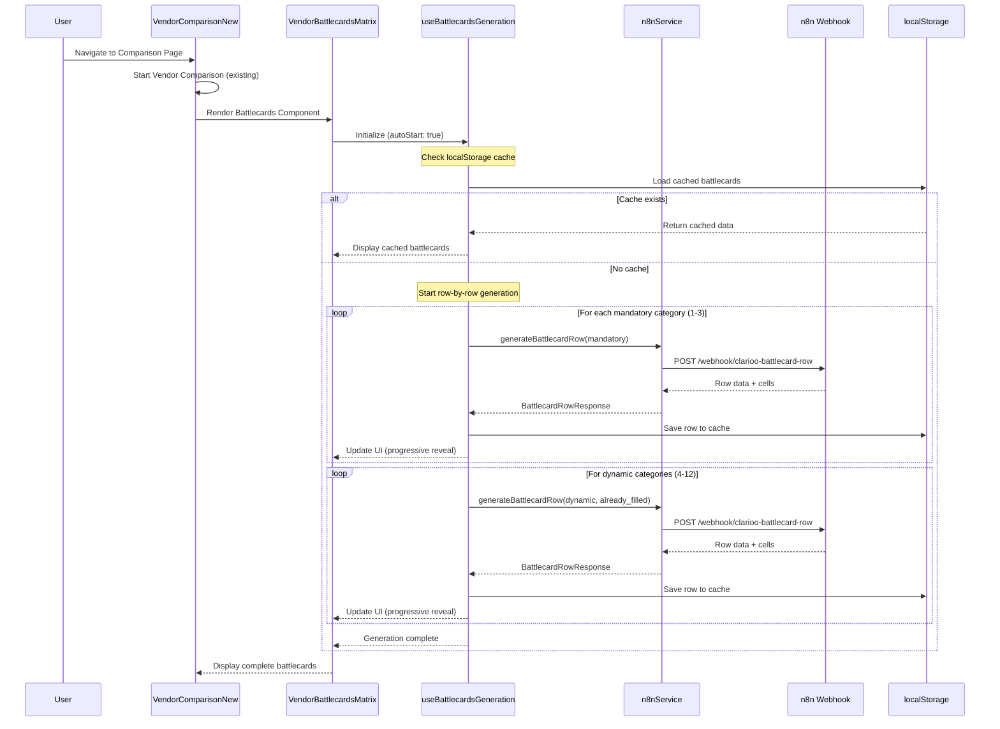

# Sprint 23: Vendor Battlecards Matrix

**Sprint ID**: SP_023
**Type**: Feature Implementation + n8n AI Integration
**Status**: 📋 PLANNED
**Estimated Duration**: 3-4 days
**Date Created**: January 10, 2026
**Phase**: Phase 1 - n8n AI Integration (Continued)

---

## 📋 Table of Contents
1. [Executive Summary](#executive-summary)
2. [Objectives](#objectives)
3. [Scope & Boundaries](#scope--boundaries)
4. [Technical Requirements](#technical-requirements)
5. [Component Architecture](#component-architecture)
6. [n8n Webhook Specification](#n8n-webhook-specification)
7. [Data Flow](#data-flow)
8. [UI/UX Specifications](#uiux-specifications)
9. [Implementation Strategy](#implementation-strategy)
10. [Testing Requirements](#testing-requirements)
11. [Acceptance Criteria](#acceptance-criteria)

---

## Executive Summary

**Purpose**: Add a standalone AI-generated Vendor Battlecards matrix that provides high-level, real-world comparison categories (pricing, verticals, key clients, integrations) beyond the criteria-based comparison matrix.

**Key Innovation**: While the existing Vendor Comparison Matrix evaluates vendors against user-defined criteria, Vendor Battlecards automatically discovers and compares vendors on industry-standard dimensions (pricing models, target verticals, key customers, partnerships) that users expect to see in vendor evaluations.

**Position**: Appears **below** the existing Vendor Comparison Matrix and **above** the Download/Share buttons in `VendorComparisonNew.tsx`.

**Relationship to Existing Features**:
- **Vendor Comparison Matrix**: Criteria-based evaluation (user's custom requirements)
- **Vendor Battlecards**: Industry-standard comparison (pricing, verticals, clients, integrations)
- **Executive Summary** (existing): Project-level recommendation based on comparison matrix
- **Battlecards Executive Summary** (future): Summary of battlecard insights (inactive in SP_023)

**Non-Goals**:
- ❌ Modify any existing components
- ❌ Change existing comparison matrix functionality
- ❌ Replace or duplicate criteria-based comparison
- ❌ Implement battlecards executive summary (deferred to future sprint)

---

## Implementation Clarifications

**✅ Confirmed Design Decisions:**

1. **Row Count**: 3 mandatory rows first, then AI decides 5-9 dynamic rows (total 8-12 rows)
2. **n8n Workflow Strategy**: AI chooses one category per call with knowledge of already covered categories, populates row-by-row sequentially
3. **Vendor Validation**: Pass exact same vendor array to both components (no separate validation layer needed)
4. **Source URL Behavior**: Identical to existing comparison matrix (small icon, opens in new tab)
5. **Cell Expansion**: Identical to existing comparison matrix (truncate after X characters, show full text if short)
6. **Mobile Swipe Navigation**: Identical pattern to existing, just 2 vendor columns visible instead of 3
7. **Progress Indicator**: Identical to VerticalBarChart implementation (percentage based on rows completed)
8. **Auto-Retry Logic**: Identical to VerticalBarChart implementation (automatic retry on error)
9. **localStorage Caching**: Standalone cache keys (e.g., `clarioo_battlecards_*`) following comparison matrix patterns
10. **All UI Patterns**: Since this is a complete clone of VendorComparisonNew.tsx, all existing patterns (loading states, error handling, retry buttons, mobile gestures) are preserved and modified only for battlecard-specific data

**Key Principle**: Clone first, then modify data source and vendor counts. Keep all existing UX patterns intact.

---

## Objectives

### Primary Goals
1. ✅ Create standalone Vendor Battlecards module with **exact UI/UX duplication** of existing Vendor Comparison Matrix
2. ✅ Implement row-by-row AI generation with progressive reveal
3. ✅ Generate 8-12 comparison categories (3 mandatory + 5-9 dynamic)
4. ✅ Support parallel generation with existing comparison matrix
5. ✅ Implement mobile (2 vendors) and desktop (3 vendors) layouts
6. ✅ Add localStorage caching with same regeneration logic as comparison matrix

### Secondary Goals
7. ✅ Card-based cell design with expandable text and source URLs
8. ✅ Automatic error retry + manual regenerate/stop buttons
9. ✅ Executive summary button (UI only, inactive until future sprint)

---

## Scope & Boundaries

### In Scope
- **Component Duplication**: Exact copies of vendor comparison components renamed for battlecards
- **n8n Integration**: New webhook for row-by-row battlecard generation
- **Progressive Loading**: Row-by-row reveal with completion indicator
- **Mobile/Desktop Layouts**: Same patterns as existing comparison, adjusted vendor counts
- **Caching Strategy**: localStorage persistence matching existing comparison patterns
- **Error Handling**: Automatic retry + manual controls

### Out of Scope
- ❌ Any changes to existing `VendorComparisonNew.tsx` or child components
- ❌ Modifications to Stage 1/Stage 2 comparison logic
- ❌ Battlecards executive summary generation (n8n workflow not ready)
- ❌ Confidence levels (Confirmed/Likely/Unknown)
- ❌ Key Differences summary strip (deferred)
- ❌ Row replacement logic for unknown cells (deferred)

### Component Boundary
```
VendorComparisonNew.tsx (EXISTING - NO CHANGES)
├── Vendor Cards (top)
├── Stage 1/Stage 2 Criteria Matrix
│   ├── VerticalBarChart.tsx (EXISTING)
│   ├── VendorCard.tsx (EXISTING)
│   ├── DesktopColumnHeader.tsx (EXISTING)
│   └── ExecutiveSummaryDialog.tsx (EXISTING)
│
└── [NEW SECTION - VENDOR BATTLECARDS]
    ├── VendorBattlecardsMatrix.tsx (NEW - DUPLICATE)
    ├── BattlecardsBarChart.tsx (NEW - DUPLICATE of VerticalBarChart)
    ├── BattlecardVendorCard.tsx (NEW - DUPLICATE of VendorCard)
    ├── BattlecardsColumnHeader.tsx (NEW - DUPLICATE of DesktopColumnHeader)
    └── BattlecardsExecutiveSummaryDialog.tsx (NEW - DUPLICATE, inactive)
```

---

## Technical Requirements

### n8n Webhook: Row-by-Row Battlecard Generation

**Webhook Name**: `clarioo-battlecard-row`
**Timeout**: 90 seconds per row
**AI Model**: GPT-4o-mini + Perplexity for vendor research
**Generation Strategy**: Progressive row-by-row with duplicate prevention

#### Request Format
```typescript
interface BattlecardRowRequest {
  user_id: string;
  session_id: string;
  project_id: string;
  project_context: string;  // company_context + solution_requirements
  vendor_names: string[];    // Array of vendor names to compare
  criteria: Array<{          // User's original criteria (for context)
    name: string;
    explanation: string;
    importance: 'low' | 'medium' | 'high';
    type: string;
  }>;
  already_filled_categories: string[];  // Categories already generated (duplicate prevention)
  is_mandatory_category?: boolean;      // True for mandatory categories (Verticals, Clients, Integrations)
  requested_category?: string;          // Specific category for mandatory rows
}
```

#### Response Format
```typescript
interface BattlecardRowResponse {
  row_id: string;               // Stable ID for caching and deduplication
  category_title: string;       // e.g., "Pricing Model", "Target Verticals", "Key Customers"
  category_definition?: string; // Optional 1-sentence explanation of what this category means
  cells: Array<{
    vendor_name: string;
    text: string;               // 1-3 sentences, can be longer (expandable UI)
    source_url?: string;        // Evidence URL from Perplexity research
  }>;
  timestamp: string;            // ISO 8601
}
```

#### Error Response
```typescript
interface BattlecardRowError {
  error: {
    code: 'INVALID_INPUT' | 'AI_PROCESSING_ERROR' | 'TIMEOUT' | 'INTERNAL_ERROR';
    message: string;
  };
}
```

---

## Component Architecture

### File Structure
```
src/
├── components/
│   ├── VendorComparisonNew.tsx (EXISTING - NO CHANGES)
│   │
│   └── vendor-battlecards/  (NEW FOLDER)
│       ├── VendorBattlecardsMatrix.tsx      (Main orchestrator - duplicate of VendorComparisonNew logic)
│       ├── BattlecardsBarChart.tsx          (Desktop chart - duplicate of VerticalBarChart.tsx)
│       ├── BattlecardVendorCard.tsx         (Mobile cards - duplicate of VendorCard.tsx)
│       ├── BattlecardsColumnHeader.tsx      (Column headers - duplicate of DesktopColumnHeader.tsx)
│       ├── BattlecardCell.tsx               (Individual cell with expandable text + source URL)
│       └── BattlecardsExecutiveSummaryDialog.tsx (Duplicate of ExecutiveSummaryDialog, inactive)
│
├── hooks/
│   └── useBattlecardsGeneration.ts          (Duplicate of useTwoStageComparison pattern)
│
├── services/
│   └── n8nService.ts                        (Add generateBattlecardRow function)
│
├── types/
│   ├── n8n.types.ts                         (Add BattlecardRowRequest/Response)
│   └── battlecards.types.ts                 (NEW - Battlecard-specific types)
│
└── utils/
    └── battlecardsStorage.ts                (NEW - localStorage utilities)
```

### Type Definitions (battlecards.types.ts)
```typescript
/**
 * Battlecard row state for progressive loading
 */
export interface BattlecardRowState {
  row_id: string;
  category_title: string;
  category_definition?: string;
  status: 'pending' | 'loading' | 'completed' | 'failed';
  cells: BattlecardCellState[];
  error?: string;
  retry_count: number;
}

/**
 * Individual cell in battlecard matrix
 */
export interface BattlecardCellState {
  vendor_name: string;
  text: string;
  source_url?: string;
  is_expanded: boolean;  // For expandable text UI
}

/**
 * Overall battlecard generation state
 */
export interface BattlecardsState {
  rows: BattlecardRowState[];
  status: 'idle' | 'running' | 'paused' | 'completed' | 'failed';
  current_row_index: number;
  total_rows: number;
  already_filled_categories: string[];
}

/**
 * Mandatory battlecard categories (always generated first)
 */
export const MANDATORY_BATTLECARD_CATEGORIES = [
  'Target Verticals',      // Industries/sectors the solution focuses on
  'Key Customers',         // Notable clients/case studies
  'Main Integrations',     // Key partnerships and integrations
] as const;
```

---

## n8n Webhook Specification

### Workflow Logic

#### Phase 1: Mandatory Categories (Rows 1-3)
1. **Request**: Send with `is_mandatory_category: true` and `requested_category: "Target Verticals"`
2. **AI Research**:
   - Use Perplexity to search: `"{vendor_name}" target industries verticals focus"`
   - Extract industries/sectors for each vendor
   - Return structured cell data with source URLs
3. **Response**: Row 1 complete with Target Verticals data
4. **Repeat**: For "Key Customers" and "Main Integrations"

#### Phase 2: Dynamic Categories (Rows 4-12)
5. **Request**: Send with `already_filled_categories: ["Target Verticals", "Key Customers", "Main Integrations"]`
6. **AI Category Selection**:
   - Analyze vendor names and project context
   - Choose relevant comparison category from pool:
     - Pricing Model (per user/month, per transaction, flat fee, custom)
     - Company Size/Maturity (startup, growth, enterprise, public)
     - Geographic Focus (North America, EMEA, APAC, global)
     - Implementation Complexity (self-serve, assisted, professional services)
     - Support Model (email, chat, phone, dedicated account manager)
     - Security/Compliance (SOC2, GDPR, HIPAA, ISO27001)
     - Deployment Options (cloud, on-premise, hybrid)
     - Contract Terms (monthly, annual, multi-year)
     - Target Company Size (SMB, mid-market, enterprise)
   - Avoid categories already in `already_filled_categories`
7. **AI Research**: Use Perplexity to find data for chosen category
8. **Response**: Dynamic row complete
9. **Repeat**: Until 8-12 total rows generated

#### Duplicate Prevention Logic
- Frontend sends `already_filled_categories` array with each request
- n8n workflow checks category selection against this list
- If conflict detected, choose different category
- Continue until unique category found or max retries (3) reached

---

## Data Flow

### Battlecards Generation Sequence



### Parallel Execution with Comparison Matrix

```
Page Load → VendorComparisonNew.tsx
    │
    ├─→ [EXISTING] Stage 1/Stage 2 Comparison
    │   ├─ useTwoStageComparison hook
    │   ├─ compareVendorCriterion (Stage 1)
    │   └─ rankCriterionResults (Stage 2)
    │
    └─→ [NEW] Vendor Battlecards
        ├─ useBattlecardsGeneration hook
        └─ generateBattlecardRow (row-by-row)

Both run in parallel, independent execution
```

---

## UI/UX Specifications

### Desktop Layout (≥768px)

**Vendor Display**: 3 vendors visible (vs 5 in comparison matrix)

```
┌─────────────────────────────────────────────────────────────┐
│  VENDOR BATTLECARDS                                         │
│  ┌─────────────┬──────────────┬──────────────┬────────────┐│
│  │ Category    │ Vendor 1     │ Vendor 2     │ Vendor 3   ││
│  ├─────────────┼──────────────┼──────────────┼────────────┤│
│  │ Target      │ Retail,      │ Healthcare,  │ Manufac-   ││
│  │ Verticals   │ E-commerce   │ Finance      │ turing     ││
│  │             │ [🔗 source]  │ [🔗 source]  │ [🔗 source]││
│  ├─────────────┼──────────────┼──────────────┼────────────┤│
│  │ Key         │ Nike, Target │ Kaiser, BCBS │ Toyota,    ││
│  │ Customers   │ Walmart      │ Anthem       │ Boeing     ││
│  │             │ [🔗 source]  │ [🔗 source]  │ [🔗 source]││
│  ├─────────────┼──────────────┼──────────────┼────────────┤│
│  │ Main        │ Shopify,     │ Epic,        │ SAP,       ││
│  │ Integrations│ Stripe       │ Salesforce   │ Oracle     ││
│  │             │ [🔗 source]  │ [🔗 source]  │ [🔗 source]││
│  └─────────────┴──────────────┴──────────────┴────────────┘│
│                                                             │
│  [Regenerate] [Stop] [Executive Summary (inactive)]        │
└─────────────────────────────────────────────────────────────┘
```

**Cell Design**:
- Card-based with subtle border and shadow
- Text: 1-3 sentences (can be longer, expandable on click)
- Source URL: Small external link icon at bottom-right
- Hover: Slight elevation effect
- Click: Expand to show full text if truncated

### Mobile Layout (<768px)

**Vendor Display**: 2 vendors visible (vs 3 in comparison matrix)

```
┌───────────────────────────────┐
│  VENDOR BATTLECARDS           │
│  Vendor 1 ◀──▶ Vendor 2       │
│                               │
│  ┌───────────┬──────────────┐│
│  │ Category  │ Vendor 1     ││
│  ├───────────┼──────────────┤│
│  │ Target    │ Retail,      ││
│  │ Verticals │ E-commerce   ││
│  │           │ [🔗]         ││
│  ├───────────┼──────────────┤│
│  │ Key       │ Nike, Target ││
│  │ Customers │ Walmart      ││
│  │           │ [🔗]         ││
│  └───────────┴──────────────┘│
│                               │
│  ← Swipe to compare vendors →│
│                               │
│  [Regenerate] [Stop]          │
└───────────────────────────────┘
```

**Mobile Navigation**:
- Same swipe gesture as existing comparison matrix
- 2 vendors visible at a time (vs 3 in comparison matrix)
- Dots indicator showing which vendors are visible
- Smooth horizontal scroll animation

### Progressive Loading States

**Initial State** (0% complete):
```
┌─────────────────────────────────┐
│ Generating battlecards...  0%   │
│                                 │
│ [⏳ Loading row 1 of 10...]     │
└─────────────────────────────────┘
```

**During Generation** (40% complete):
```
┌─────────────────────────────────┐
│ Generating battlecards... 40%   │
│                                 │
│ ✅ Target Verticals             │
│ ✅ Key Customers                │
│ ✅ Main Integrations            │
│ ✅ Pricing Model                │
│ [⏳ Loading Company Size...]    │
│ ⏸️  Geographic Focus (pending)  │
│ ⏸️  Support Model (pending)     │
│                                 │
│ [Stop Generation]               │
└─────────────────────────────────┘
```

**Complete** (100%):
```
┌─────────────────────────────────┐
│ ✅ Battlecards complete!         │
│                                 │
│ [All 10 categories loaded]      │
│                                 │
│ [Regenerate] [Download]         │
└─────────────────────────────────┘
```

### Error State
```
┌─────────────────────────────────┐
│ ❌ Failed to generate row       │
│                                 │
│ Category: "Pricing Model"       │
│ Error: Timeout after 90s        │
│                                 │
│ [Auto-retry in 3s...] [Skip]    │
└─────────────────────────────────┘
```

---

## Implementation Strategy

### Phase 1: Component Duplication (Day 1)
**Goal**: Exact copies of all comparison components, no functionality changes

1. **Create new folder**: `src/components/vendor-battlecards/`
2. **Duplicate components**:
   - Copy `VendorComparisonNew.tsx` → `VendorBattlecardsMatrix.tsx`
   - Copy `VerticalBarChart.tsx` → `BattlecardsBarChart.tsx`
   - Copy `VendorCard.tsx` → `BattlecardVendorCard.tsx`
   - Copy `DesktopColumnHeader.tsx` → `BattlecardsColumnHeader.tsx`
   - Copy `ExecutiveSummaryDialog.tsx` → `BattlecardsExecutiveSummaryDialog.tsx`
3. **Rename all internal references**:
   - Component names
   - CSS classes
   - localStorage keys (prevent conflicts)
   - Hook names
4. **Visual verification**: Ensure duplicates render identically to originals
5. **No functional changes yet** - just exact duplicates

**Acceptance Criteria for Phase 1**:
- ✅ All duplicated components render without errors
- ✅ Visual appearance matches existing comparison matrix
- ✅ No conflicts with existing components
- ✅ localStorage uses separate keys (e.g., `clarioo_battlecards_*`)

### Phase 2: Integration into VendorComparisonNew (Day 1)
**Goal**: Add battlecards section below comparison matrix

1. **Modify VendorComparisonNew.tsx**:
   ```tsx
   // Add import
   import { VendorBattlecardsMatrix } from './vendor-battlecards/VendorBattlecardsMatrix';

   // Add to render (after existing comparison matrix, before Download/Share)
   return (
     <div>
       {/* EXISTING: Vendor cards and comparison matrix */}
       <div className="existing-comparison-matrix">
         {/* ... existing code ... */}
       </div>

       {/* NEW: Vendor Battlecards */}
       <div className="mt-16 border-t-2 border-gray-200 pt-8">
         <h2 className="text-2xl font-bold mb-4">Vendor Battlecards</h2>
         <VendorBattlecardsMatrix
           projectId={projectId}
           vendors={vendors}
           criteria={criteria}
           techRequest={techRequest}
         />
       </div>

       {/* EXISTING: Download/Share buttons */}
     </div>
   );
   ```

2. **Visual verification**: Ensure two separate sections render without layout conflicts

**Acceptance Criteria for Phase 2**:
- ✅ Battlecards appear below comparison matrix
- ✅ Clear visual separation between sections
- ✅ No layout conflicts or overlapping
- ✅ Responsive on mobile and desktop

### Phase 3: n8n Service Integration (Day 2)
**Goal**: Create n8n service function for row-by-row generation

1. **Add types to `src/types/n8n.types.ts`**:
   ```typescript
   export interface BattlecardRowRequest { /* ... */ }
   export interface BattlecardRowResponse { /* ... */ }
   export interface BattlecardRowError { /* ... */ }
   ```

2. **Add service function to `src/services/n8nService.ts`**:
   ```typescript
   export async function generateBattlecardRow(
     projectId: string,
     projectContext: string,
     vendorNames: string[],
     criteria: any[],
     alreadyFilledCategories: string[],
     isMandatoryCategory?: boolean,
     requestedCategory?: string
   ): Promise<BattlecardRowResponse>
   ```

3. **Implement request/response handling**:
   - Timeout: 90 seconds per row
   - Error handling with automatic retry (max 3 attempts)
   - AbortController for cancellation
   - Same pattern as existing n8n functions

4. **Create localStorage utilities** (`src/utils/battlecardsStorage.ts`):
   ```typescript
   export function saveBattlecardRow(projectId: string, row: BattlecardRowState): void;
   export function loadBattlecardRows(projectId: string): BattlecardRowState[];
   export function clearBattlecardCache(projectId: string): void;
   ```

**Acceptance Criteria for Phase 3**:
- ✅ n8n service function successfully calls webhook
- ✅ Request/response types match webhook spec
- ✅ Timeout and error handling work correctly
- ✅ localStorage caching implemented

### Phase 4: Hook Implementation (Day 2-3)
**Goal**: Create orchestration hook for progressive row-by-row generation

1. **Create `src/hooks/useBattlecardsGeneration.ts`**:
   - Duplicate pattern from `useTwoStageComparison.ts`
   - Manage battlecard generation state
   - Progressive row-by-row loading
   - Duplicate prevention logic
   - Pause/resume/regenerate controls

2. **Key functions**:
   ```typescript
   export interface UseBattlecardsGenerationReturn {
     battlecardsState: BattlecardsState;
     isRunning: boolean;
     progress: number; // 0-100
     startGeneration: () => void;
     stopGeneration: () => void;
     regenerate: () => void;
     retryRow: (rowId: string) => Promise<void>;
   }
   ```

3. **Generation sequence**:
   - Check localStorage cache first
   - If no cache, start with mandatory categories (1-3)
   - Then generate dynamic categories (4-12)
   - Update state progressively after each row
   - Save to localStorage after each successful row

**Acceptance Criteria for Phase 4**:
- ✅ Hook manages generation state correctly
- ✅ Progressive row-by-row reveal works
- ✅ Mandatory categories generated first (1-3)
- ✅ Dynamic categories fill remaining rows (4-12)
- ✅ Duplicate prevention logic prevents repeated categories
- ✅ Pause/resume/regenerate controls functional

### Phase 5: UI Component Modifications (Day 3)
**Goal**: Adapt duplicated components for battlecard-specific functionality

1. **VendorBattlecardsMatrix.tsx**:
   - Replace comparison data hooks with battlecards hook
   - Adjust vendor display counts (desktop: 3, mobile: 2)
   - Add progress indicator
   - Wire up regenerate/stop buttons
   - Disable executive summary button (placeholder only)

2. **BattlecardsBarChart.tsx**:
   - Replace criteria rows with battlecard categories
   - Replace star/tick cells with text cards
   - Add expandable cell functionality
   - Add source URL link icons
   - Adjust for 3 vendor columns (desktop)

3. **BattlecardCell.tsx** (new component):
   - Card-based design with border and shadow
   - Text content (1-3 sentences, expandable)
   - Source URL icon (bottom-right)
   - Click to expand/collapse
   - Hover effects

4. **Mobile adjustments**:
   - BattlecardVendorCard.tsx: 2 vendors visible
   - Swipe navigation between vendor pairs
   - Responsive card sizing

**Acceptance Criteria for Phase 5**:
- ✅ Desktop shows 3 vendors (vs 5 in comparison matrix)
- ✅ Mobile shows 2 vendors (vs 3 in comparison matrix)
- ✅ Cells display as cards with expandable text
- ✅ Source URLs displayed as clickable icons
- ✅ Progress indicator shows generation status
- ✅ Regenerate/Stop buttons functional
- ✅ Executive summary button present but inactive

### Phase 6: Testing & Polish (Day 4)
**Goal**: Comprehensive testing and visual polish

1. **Unit tests** (per GL-TDD.md):
   - Test `generateBattlecardRow()` service function
   - Test `useBattlecardsGeneration()` hook
   - Test localStorage utilities
   - Test duplicate prevention logic

2. **Integration tests**:
   - Test parallel execution with comparison matrix
   - Test cache loading and regeneration
   - Test error handling and retry logic
   - Test mobile swipe navigation

3. **Visual verification** (acceptable per GL-TDD.md Phase 1):
   - Desktop layout at 1920px, 1440px, 1024px
   - Mobile layout at 375px, 414px
   - Tablet layout at 768px
   - Cell expansion behavior
   - Loading states and animations

4. **Polish**:
   - Animation timing adjustments
   - Loading skeleton refinements
   - Error message clarity
   - Accessibility (keyboard navigation, screen readers)

**Acceptance Criteria for Phase 6**:
- ✅ All unit tests pass
- ✅ Integration tests verify parallel execution
- ✅ Visual verification complete across breakpoints
- ✅ Error handling tested with failed webhooks
- ✅ Accessibility requirements met

---

## Testing Requirements

### Unit Tests (GL-TDD.md - Required for n8n Integration)

**File**: `test/unit/services/n8nService.battlecards.test.ts`
```typescript
describe('generateBattlecardRow', () => {
  test('successfully generates mandatory category row', async () => {
    // Test mandatory category request/response
  });

  test('successfully generates dynamic category row', async () => {
    // Test dynamic category with duplicate prevention
  });

  test('handles timeout errors with retry', async () => {
    // Test timeout and automatic retry logic
  });

  test('prevents duplicate categories', async () => {
    // Test already_filled_categories logic
  });
});
```

**File**: `test/unit/hooks/useBattlecardsGeneration.test.ts`
```typescript
describe('useBattlecardsGeneration', () => {
  test('loads cached battlecards on mount', async () => {
    // Test localStorage cache loading
  });

  test('generates mandatory categories first', async () => {
    // Test 3 mandatory categories generated before dynamic
  });

  test('generates 8-12 total rows', async () => {
    // Test total row count enforcement
  });

  test('progressive row-by-row reveal', async () => {
    // Test state updates after each row
  });

  test('pause and resume generation', async () => {
    // Test pause/resume controls
  });
});
```

**File**: `test/unit/utils/battlecardsStorage.test.ts`
```typescript
describe('battlecardsStorage', () => {
  test('saves and loads battlecard rows', () => {
    // Test localStorage CRUD operations
  });

  test('clears battlecard cache', () => {
    // Test cache invalidation
  });
});
```

### Integration Tests

**File**: `test/integration/battlecards.test.ts`
```typescript
describe('Vendor Battlecards Integration', () => {
  test('generates in parallel with comparison matrix', async () => {
    // Verify both run independently
  });

  test('displays below comparison matrix in DOM', () => {
    // Test component placement
  });

  test('regenerate clears cache and restarts', async () => {
    // Test regeneration flow
  });
});
```

### Visual Verification (Acceptable per GL-TDD.md Phase 1)

**Desktop**:
- [ ] 1920px: 3 vendors visible, proper spacing
- [ ] 1440px: 3 vendors visible, responsive adjustments
- [ ] 1024px: 3 vendors visible, compact layout

**Mobile**:
- [ ] 375px: 2 vendors, swipe navigation works
- [ ] 414px: 2 vendors, proper card sizing

**Tablet**:
- [ ] 768px: Transition between mobile/desktop layouts

**Interactions**:
- [ ] Cell expansion on click
- [ ] Source URL opens in new tab
- [ ] Progress indicator updates during generation
- [ ] Regenerate button clears and restarts
- [ ] Stop button pauses generation

---

## Acceptance Criteria

### Definition of Done

1. **Component Duplication**:
   - ✅ All comparison components duplicated with new names
   - ✅ No changes to existing comparison components
   - ✅ Visual consistency with existing comparison matrix

2. **n8n Integration**:
   - ✅ Webhook `clarioo-battlecard-row` functional
   - ✅ Row-by-row generation with progressive reveal
   - ✅ 3 mandatory categories always generated (Verticals, Clients, Integrations)
   - ✅ 5-9 dynamic categories generated (total 8-12 rows)
   - ✅ Duplicate prevention logic works

3. **UI/UX**:
   - ✅ Desktop: 3 vendors visible
   - ✅ Mobile: 2 vendors visible with swipe navigation
   - ✅ Card-based cell design with expandable text
   - ✅ Source URL icons clickable
   - ✅ Progress indicator shows completion percentage
   - ✅ Loading states show row-by-row reveal

4. **Controls**:
   - ✅ Regenerate button clears cache and restarts
   - ✅ Stop button pauses generation
   - ✅ Executive summary button present (inactive)
   - ✅ Automatic retry on error (max 3 attempts)

5. **Data Persistence**:
   - ✅ localStorage caching with key: `clarioo_battlecards_{projectId}`
   - ✅ Cache loaded on page refresh
   - ✅ Regenerate clears cache

6. **Parallel Execution**:
   - ✅ Battlecards generation starts on page load
   - ✅ Runs in parallel with comparison matrix
   - ✅ No interference between modules

7. **Testing**:
   - ✅ Unit tests pass for n8n service functions
   - ✅ Unit tests pass for hooks
   - ✅ Integration tests verify parallel execution
   - ✅ Visual verification complete

8. **Documentation**:
   - ✅ Sprint plan complete (this document)
   - ✅ PROGRESS.md updated with SP_023
   - ✅ PROJECT_ROADMAP.md updated with battlecards feature
   - ✅ FEATURE_LIST.md includes battlecards
   - ✅ Code comments follow existing patterns

---

## Related Documents

- **Current Sprint**: [SP_022_Template_Carousel_Section.md](./SP_022_Template_Carousel_Section.md)
- **Previous Comparison Sprint**: [SP_018_N8N_Vendor_Selection_Integration.md](./SP_018_N8N_Vendor_Selection_Integration.md)
- **Architecture**: [ARCHITECTURE.md](../ARCHITECTURE.md)
- **Codebase Structure**: [CODEBASE_STRUCTURE.md](../CODEBASE_STRUCTURE.md)
- **Progress Tracking**: [PROGRESS.md](../PROGRESS.md)

---

## Notes

### Future Enhancements (Deferred)
- [ ] Battlecards executive summary generation (separate n8n workflow)
- [ ] Confidence levels (Confirmed/Likely/Unknown)
- [ ] Key Differences summary strip (5-10 bullets above table)
- [ ] Row replacement logic for >70% unknown cells
- [ ] Vendor selection change (inline dropdown)
- [ ] Multi-vendor comparison (>5 vendors)

### n8n Workflow Design
- Separate document needed: `SP_023_Vendor_Battlecards/n8n_workflow_design.md`
- AI prompt engineering for category selection
- Perplexity search strategy per category
- Evidence URL extraction logic

---

**Document Owner**: Engineering Team
**Created**: January 10, 2026
**Status**: Ready for Implementation
**Next Step**: Begin Phase 1 - Component Duplication
