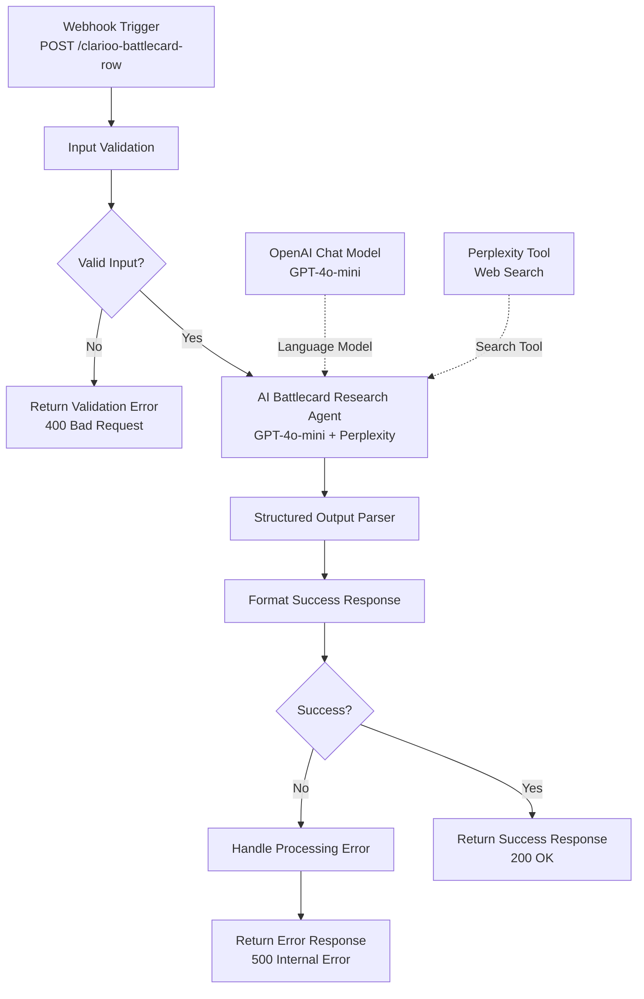

# n8n Workflow Design: Vendor Battlecards Row Generator

**Workflow Name**: `Clarioo AI Battlecard Row Generator`
**Webhook Path**: `/clarioo-battlecard-row`
**File**: `Clarioo_AI_Battlecard_Row.json`
**Status**: Ready for Import
**Created**: January 10, 2026

---

## Overview

This workflow generates **ONE battlecard comparison row at a time**, researching a specific category (e.g., Pricing, Target Verticals, Key Customers) across multiple vendors.

### Key Differences from Vendor Comparison Workflow

| Aspect | Vendor Comparison | Vendor Battlecards |
|--------|-------------------|-------------------|
| **Input** | Single vendor + all criteria | Multiple vendors + category selection |
| **Process** | Research vendor across all criteria | Research all vendors for ONE category |
| **Output** | Complete vendor evaluation | ONE row with cells for each vendor |
| **Execution** | One vendor at a time | One category/row at a time |
| **Search Strategy** | 25 searches for vendor depth | 15 searches for category breadth |
| **Data Format** | Scores (yes/star/no/unknown) | Text descriptions (1-3 sentences) |

---

## Workflow Architecture



---

## Input Specification

### Request Body
```json
{
  "user_id": "uuid-v4",
  "session_id": "uuid-v4",
  "project_id": "proj_123",
  "project_context": "Company context + solution requirements",
  "vendor_names": ["Salesforce", "HubSpot", "Pipedrive"],
  "criteria": [
    {
      "id": "crit_1",
      "name": "CRM Integration",
      "explanation": "Must integrate with existing CRM",
      "importance": "high",
      "type": "technical"
    }
  ],
  "already_filled_categories": ["Target Verticals", "Key Customers"],
  "is_mandatory_category": false,
  "requested_category": null,
  "timestamp": "2026-01-10T12:00:00Z"
}
```

### Input Parameters

| Parameter | Type | Required | Description |
|-----------|------|----------|-------------|
| `user_id` | string | ✅ | User UUID |
| `session_id` | string | ✅ | Session UUID |
| `project_id` | string | ✅ | Project UUID |
| `project_context` | string | ✅ | Min 10 chars, company context + requirements |
| `vendor_names` | string[] | ✅ | Array of vendor names (max 5) |
| `criteria` | object[] | ✅ | User's evaluation criteria (for context only) |
| `already_filled_categories` | string[] | ✅ | Categories already generated (for duplicate prevention) |
| `is_mandatory_category` | boolean | ❌ | True if requesting specific mandatory category |
| `requested_category` | string | ❌ | Specific category name (required if `is_mandatory_category` = true) |
| `timestamp` | string | ✅ | ISO 8601 timestamp |

---

## Output Specification

### Success Response (200 OK)
```json
{
  "success": true,
  "row": {
    "row_id": "battlecard_row_1",
    "category_title": "Pricing Model",
    "category_definition": "How vendors structure their pricing and billing",
    "cells": [
      {
        "vendor_name": "Salesforce",
        "text": "$25-300 per user/month across 5 editions. Enterprise Edition at $150/user includes advanced automation. Custom pricing for 500+ users with volume discounts.",
        "source_url": "https://www.salesforce.com/pricing/"
      },
      {
        "vendor_name": "HubSpot",
        "text": "Free CRM with paid hubs starting at $45/month. Sales Hub Professional at $450/month for 5 users. Enterprise tier custom pricing with onboarding included.",
        "source_url": "https://www.hubspot.com/pricing/crm"
      },
      {
        "vendor_name": "Pipedrive",
        "text": "$14-99 per user/month with 14-day free trial. Essential plan at $14 includes mobile app and integrations. No setup fees or annual commitments.",
        "source_url": "https://www.pipedrive.com/pricing"
      }
    ],
    "timestamp": "2026-01-10T12:05:30Z"
  },
  "research_summary": "Completed battlecard row: Pricing Model for 3 vendors"
}
```

### Error Responses

**Validation Error (400 Bad Request)**:
```json
{
  "success": false,
  "error": {
    "code": "INVALID_INPUT",
    "message": "vendor_names must be a non-empty array, project_context must be at least 10 characters"
  }
}
```

**Processing Error (500 Internal Server Error)**:
```json
{
  "success": false,
  "error": {
    "code": "AI_PROCESSING_ERROR",
    "message": "Battlecard row generation failed: Invalid cell data"
  }
}
```

---

## AI Research Process

### Phase 1: Category Selection (if not mandatory)

**Criteria**:
- Category NOT in `already_filled_categories`
- Relevant to the vendors being compared
- Discoverable through web research
- Relates to user's evaluation context

**Mandatory Categories** (first 3 rows):
1. Target Verticals
2. Key Customers
3. Main Integrations

**Dynamic Category Pool**:
- Pricing Model
- Company Size/Maturity
- Geographic Focus
- Implementation Complexity
- Support Model
- Security/Compliance
- Deployment Options
- Contract Terms
- Target Company Size
- Industry Vertical Specialization

### Phase 2: Vendor Research (per chosen category)

**Search Strategy**:
- 2-3 searches per vendor
- Maximum 15 searches total
- Prioritize official documentation
- Validate with third-party sources

**Search Patterns**:
```
"[Vendor Name] [category] 2024"
"[Vendor Name] vs competitors [category]"
"[Vendor Name] [category] features comparison"
```

**Example**: If category = "Pricing Model":
```
"Salesforce pricing model per user 2024"
"HubSpot pricing vs Salesforce pricing structure"
"Pipedrive pricing tiers and features"
```

### Phase 3: Text Generation

**Requirements**:
- 1-3 sentences per vendor cell
- Specific details (numbers, names, features)
- Scannable and factual
- No marketing language
- Source URL for evidence

**Good Examples**:
- ✅ "$25-100 per user/month based on edition. Enterprise custom pricing for 500+ users. Free trial available for 14 days."
- ✅ "Major clients include Walmart, Amazon, Toyota. Strong presence in retail (40%), manufacturing (30%), logistics (20%)."
- ✅ "Native integrations with Salesforce, SAP, Oracle. REST API for custom integrations. Zapier support for 1000+ apps."

**Bad Examples**:
- ❌ "Flexible pricing" (too vague)
- ❌ "Many Fortune 500 clients" (not specific)
- ❌ "Excellent integration capabilities" (marketing language)

---

## Search Budget Management

| Vendors | Searches per Vendor | Total Searches |
|---------|---------------------|----------------|
| 2 | 3 | 6 |
| 3 | 3 | 9 |
| 4 | 3-4 | 12-15 |
| 5 | 3 | 15 |

**Budget Allocation**:
- Category selection: 0-2 searches (only if dynamic)
- Vendor research: 2-3 searches per vendor
- Validation: 0-2 searches for cross-checking
- **Maximum**: 15 searches total

---

## Node Configuration

### 1. Webhook Trigger
- **Path**: `clarioo-battlecard-row`
- **Method**: POST
- **CORS Headers**: Configured for `https://demo.clarioo.io`

### 2. Input Validation
- **Type**: Code node (JavaScript)
- **Purpose**: Validate all required parameters
- **Error Codes**: `INVALID_INPUT`

### 3. AI Battlecard Research Agent
- **Type**: LangChain Agent
- **Model**: GPT-4o-mini
- **Temperature**: 0.3
- **Max Tokens**: 6000
- **Tools**: Perplexity (web search)
- **Search Budget**: 15 searches maximum

### 4. Structured Output Parser
- **Type**: LangChain Output Parser
- **Schema**: Enforces battlecard row structure
- **Validation**: Ensures all required fields present

### 5. Format Success Response
- **Type**: Code node (JavaScript)
- **Purpose**: Validate and format final response
- **Checks**:
  - Row ID and category title present
  - Cells array matches vendor count
  - All cells have vendor_name and text
  - Warning if source_url missing

---

## Deployment Instructions

### Import into n8n

1. **Open n8n**: Navigate to your n8n instance
2. **Import Workflow**:
   - Click "Add workflow" → "Import from File"
   - Select `Clarioo_AI_Battlecard_Row.json`
3. **Configure Credentials**:
   - OpenAI API: Set API key in "OpenAI Chat Model" node
   - Perplexity API: Set API key in "Message a model in Perplexity" node
4. **Update CORS**: Change `Access-Control-Allow-Origin` to your domain
5. **Activate Workflow**: Toggle "Active" to enable webhook

### Webhook URL

After activation, the webhook will be available at:
```
https://your-n8n-domain.com/webhook/clarioo-battlecard-row
```

Update the frontend `n8nService.ts` to use this URL.

---

## Testing

### Test Request (Mandatory Category)
```bash
curl -X POST https://your-n8n-domain.com/webhook/clarioo-battlecard-row \
  -H "Content-Type: application/json" \
  -d '{
    "user_id": "test-user-123",
    "session_id": "test-session-456",
    "project_id": "test-proj-789",
    "project_context": "B2B SaaS company looking for CRM solution for 50-person sales team",
    "vendor_names": ["Salesforce", "HubSpot", "Pipedrive"],
    "criteria": [
      {
        "id": "crit_1",
        "name": "Email Integration",
        "explanation": "Must sync with Gmail/Outlook",
        "importance": "high",
        "type": "technical"
      }
    ],
    "already_filled_categories": [],
    "is_mandatory_category": true,
    "requested_category": "Target Verticals",
    "timestamp": "2026-01-10T12:00:00Z"
  }'
```

### Test Request (Dynamic Category)
```bash
curl -X POST https://your-n8n-domain.com/webhook/clarioo-battlecard-row \
  -H "Content-Type: application/json" \
  -d '{
    "user_id": "test-user-123",
    "session_id": "test-session-456",
    "project_id": "test-proj-789",
    "project_context": "B2B SaaS company looking for CRM solution for 50-person sales team",
    "vendor_names": ["Salesforce", "HubSpot", "Pipedrive"],
    "criteria": [
      {
        "id": "crit_1",
        "name": "Email Integration",
        "explanation": "Must sync with Gmail/Outlook",
        "importance": "high",
        "type": "technical"
      }
    ],
    "already_filled_categories": ["Target Verticals", "Key Customers", "Main Integrations"],
    "is_mandatory_category": false,
    "requested_category": null,
    "timestamp": "2026-01-10T12:00:00Z"
  }'
```

### Expected Results

- **Response Time**: 60-90 seconds per row
- **Search Count**: 6-15 searches (visible in n8n execution log)
- **Cell Quality**: Specific, factual, 1-3 sentences each
- **Source URLs**: All cells should have evidence URLs

---

## Error Handling

### Common Errors

| Error Code | HTTP | Cause | Solution |
|------------|------|-------|----------|
| `INVALID_INPUT` | 400 | Missing or invalid parameters | Check all required fields |
| `AI_PROCESSING_ERROR` | 500 | AI failed to generate valid output | Retry with simpler category |
| `TIMEOUT` | 500 | Workflow exceeded 90s | Reduce vendor count or simplify |
| `INTERNAL_ERROR` | 500 | Unexpected workflow failure | Check n8n logs |

### Retry Strategy

Frontend should implement:
- **Automatic retry**: Max 3 attempts with exponential backoff (3s, 9s, 27s)
- **User control**: Manual "Skip" button to move to next row
- **Error display**: Show specific error message from `error.message`

---

## Performance Optimization

### Search Efficiency
- Use official vendor pages first (faster, more reliable)
- Cache search results within workflow execution
- Batch similar searches when possible

### Output Quality
- Prioritize specificity over length
- Include numbers, names, dates when available
- Cross-reference multiple sources for validation

### Cost Management
- GPT-4o-mini: ~$0.015 per row (6K tokens)
- Perplexity searches: ~$0.005 per search (15 searches max)
- **Total cost per row**: ~$0.09-$0.12

---

## Monitoring

### Key Metrics

Track in n8n execution history:
- Execution time per row
- Search count per row
- Success/failure rate
- Most common error codes
- Category selection distribution

### Quality Checks

Manually review first 10-20 generated rows for:
- Text specificity (are numbers/names included?)
- Source URL relevance (do they match the cell content?)
- Category diversity (good mix of categories?)
- Duplicate prevention (no repeated categories?)

---

## Future Enhancements

### Phase 2 (Deferred)
- Row replacement logic (if >70% cells are "Unknown")
- Confidence levels (Confirmed/Likely/Unknown)
- Multi-language support
- Industry-specific category pools

### Phase 3 (Long-term)
- ML-based category selection (learn from user interactions)
- Vendor comparison insights ("X is better than Y for...")
- Trend analysis ("Pricing increased 20% year-over-year")

---

**Document Owner**: Engineering Team
**Last Updated**: January 10, 2026
**Related Sprint**: [SP_023_Vendor_Battlecards.md](../SP_023_Vendor_Battlecards.md)
