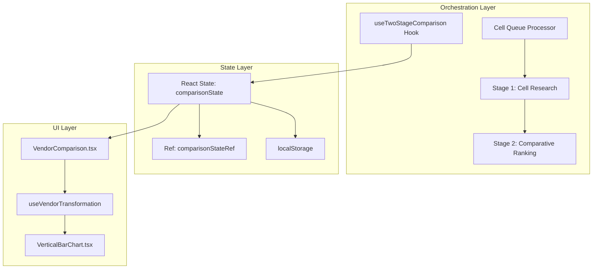
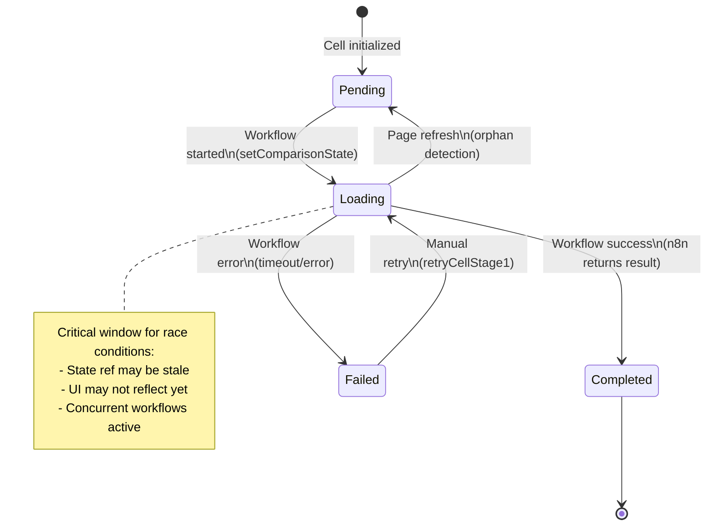
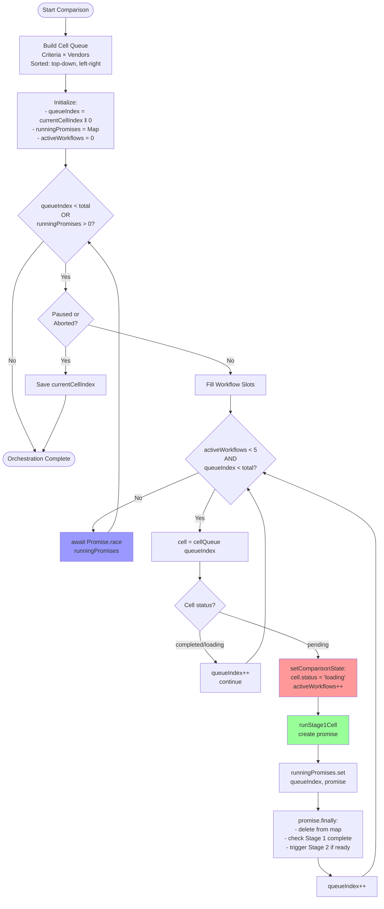
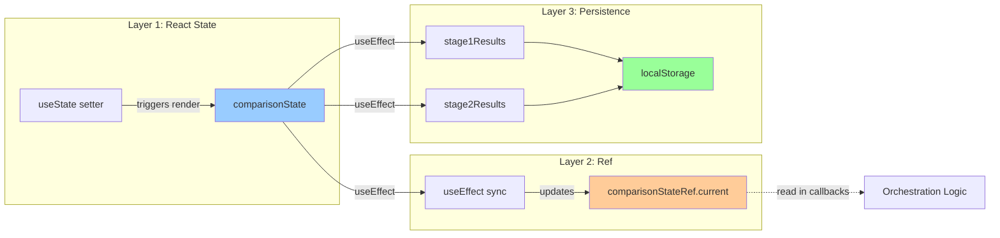
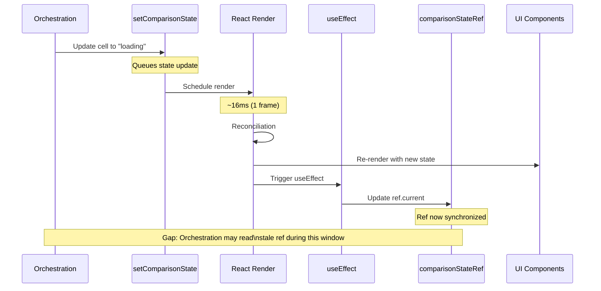
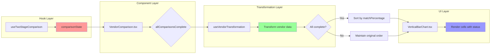
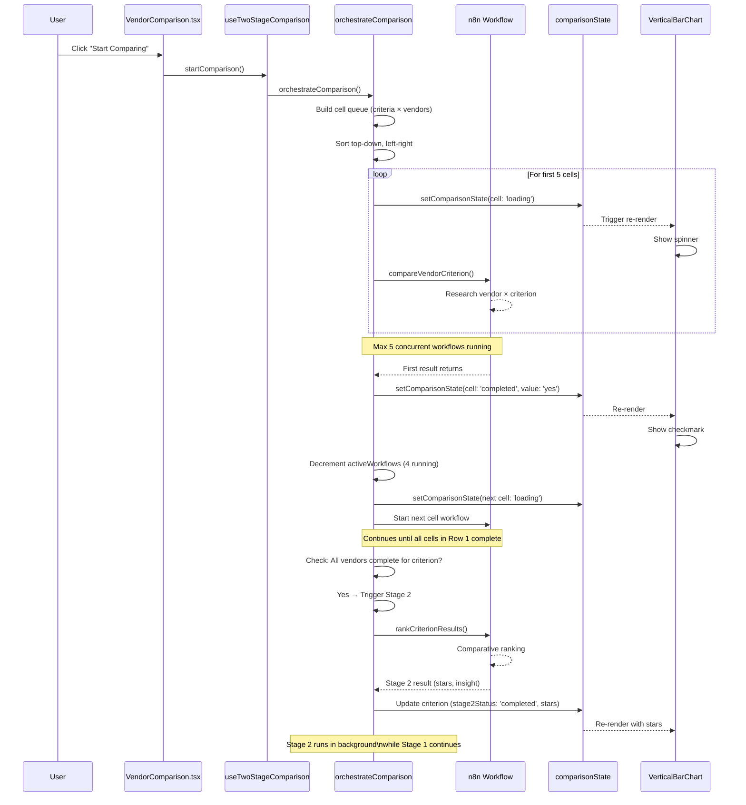

# Cell State Flow Analysis: Two-Stage Vendor Comparison System

**Date:** 2025-12-02
**Author:** Technical Analysis
**Purpose:** Comprehensive investigation of cell activation, state rendering, and workflow execution

---

## Table of Contents

1. [System Architecture Overview](#system-architecture-overview)
2. [Cell State Lifecycle](#cell-state-lifecycle)
3. [Workflow Orchestration Flow](#workflow-orchestration-flow)
4. [State Management Architecture](#state-management-architecture)
5. [UI Rendering Pipeline](#ui-rendering-pipeline)
6. [Complete Execution Flow](#complete-execution-flow)
7. [Race Conditions & Timing Issues](#race-conditions--timing-issues)
8. [Critical Problems Identified](#critical-problems-identified)
9. [Recommendations](#recommendations)

---

## System Architecture Overview

### Core Components



### Data Flow Summary

1. **Orchestration** manages workflow execution
2. **State** persists across React state, refs, and localStorage
3. **UI** renders based on transformed state data

---

## Cell State Lifecycle

### State Transition Diagram



### Cell State Structure

```typescript
interface CellState {
  status: 'pending' | 'loading' | 'completed' | 'failed';
  value?: 'yes' | 'no' | 'unknown' | 'star';      // From Stage 1
  evidenceUrl?: string;                            // From Stage 1
  evidenceDescription?: string;                    // From Stage 1
  comment?: string;                                // From Stage 1
  error?: string;                                  // On failure
  errorCode?: string;                              // 'TIMEOUT' | 'HTTP_400' etc
  retryCount?: number;                             // Track retry attempts
}
```

### State Properties by Phase

| Property | Pending | Loading | Completed | Failed |
|----------|---------|---------|-----------|--------|
| `status` | ✓ | ✓ | ✓ | ✓ |
| `value` | ❌ | ❌ | ✓ | ❌ |
| `evidenceUrl` | ❌ | ❌ | ✓ (opt) | ❌ |
| `comment` | ❌ | ❌ | ✓ (opt) | ❌ |
| `error` | ❌ | ❌ | ❌ | ✓ |
| `retryCount` | ❌ | ❌ | ❌ | ✓ (opt) |

---

## Workflow Orchestration Flow

### Queue-Based Processing Architecture



### Concurrency Control

**MAX_CONCURRENT_WORKFLOWS = 5**

```mermaid
gantt
    title Cell Processing Timeline (Example: 18 criteria × 5 vendors = 90 cells)
    dateFormat X
    axisFormat %L

    section Row 1 (5 cells)
    Cell 1.1 :active, 0, 100
    Cell 1.2 :active, 0, 120
    Cell 1.3 :active, 0, 80
    Cell 1.4 :active, 0, 150
    Cell 1.5 :active, 0, 110

    section Row 2 (5 cells)
    Cell 2.1 :80, 130
    Cell 2.2 :100, 140
    Cell 2.3 :110, 160
    Cell 2.4 :120, 170
    Cell 2.5 :150, 180

    section Row 3 (5 cells)
    Cell 3.1 :130, 200
    Cell 3.2 :140, 210
```



**Key Points:**
- Only 5 workflows run concurrently
- Top-left cells processed first (strict priority)
- Next cell starts when any of the 5 completes
- Row 2 doesn't start until Row 1 has completed cells

---

## State Management Architecture

### Three-Layer State System



### State Update Sequence



### Critical Timing Window

**Problem:** Between `setComparisonState()` and ref update (16-32ms), orchestration may read stale ref data.

```
T=0ms:    setComparisonState({ cell: 'loading' })
T=1ms:    Check next cell (ref still shows 'pending')  ⚠️ STALE!
T=16ms:   React render completes
T=17ms:   useEffect updates ref
T=18ms:   Now ref is correct
```

---

## UI Rendering Pipeline

### Complete Data Flow



### Cell Rendering Logic (VerticalBarChart.tsx)

**Status Display Mapping:**

```typescript
// Cell status → UI element
'pending'   → Gray dot (●)
'loading'   → Blue spinner (🔄)
'completed' →
  - value='yes'     → Green checkmark (✓)
  - value='no'      → Red X (✗)
  - value='unknown' → Gray question mark (?)
  - value='star'    → Yellow star (⭐)
'failed'    → Red error icon (⚠️)
```

### Vendor Transformation Performance

**Current Implementation (O(v × c) on every update):**

```typescript
// useVendorTransformation.ts - runs on EVERY state change
const vendors = useMemo(() => {
  return workflowVendors.map((v, index) => {
    const comparisonState = vendorComparisonStates?.[v.id];  // ❌ Expensive lookup
    const comparedData = comparisonState?.comparedData;

    if (comparedData) {
      const matchPercentage = calculateMatchPercentage(/* ... */);  // ❌ Recalculated
      return { /* ... */ };
    }
    return { /* fallback */ };
  });
}, [workflowVendors, vendorComparisonStates, allComparisonsComplete]);  // ❌ Triggers on every cell update
```

**Problem:** `vendorComparisonStates` is rebuilt on every cell state change, triggering complete re-transformation.

---

## Complete Execution Flow

### End-to-End Sequence



---

## Race Conditions & Timing Issues

### Race Condition #1: Stale Ref in Concurrent Execution

**Scenario:**
```typescript
// T=0: Cell A starts
setComparisonState(prev => ({
  criteria: { [criterionId]: { cells: { [vendorA]: { status: 'loading' } } } }
}));

// T=1: Before React renders, Cell B checks
const cellState = comparisonStateRef.current.criteria[criterionId].cells[vendorB];
// ❌ Ref still has old state! May start duplicate workflow
```

**Impact:** Could start same cell twice if ref isn't updated before next cell check.

**Current Mitigation:** Queue index ensures different cells, but orphaned "loading" cells can block retries.

---

### Race Condition #2: Active Workflow Counter Desynchronization

**Problem:**
```typescript
// useTwoStageComparison.ts

// Increment happens in two places:
activeWorkflowsRef.current++;  // Line 756 (before workflow)

// Decrement happens in finally block:
activeWorkflowsRef.current--;  // Line 411 (after workflow)

// State counter updates separately:
setComparisonState(prev => ({ activeWorkflows: activeWorkflowsRef.current + 1 }));  // Line 751
setComparisonState(prev => ({ activeWorkflows: activeWorkflowsRef.current }));      // Line 607
```

**Sequence of Events:**
1. Ref increments: `activeWorkflowsRef.current = 1`
2. State updates (async): `comparisonState.activeWorkflows = 1`
3. Workflow completes
4. Ref decrements: `activeWorkflowsRef.current = 0`
5. State updates (async): `comparisonState.activeWorkflows = 0`

**Race Condition:**
- If step 4-5 happen before step 2 completes, state could show wrong count
- Multiple concurrent updates can overwrite each other

**Impact:** UI may show incorrect active workflow count, orchestration logic is safe (uses ref).

---

### Race Condition #3: Stage 2 Trigger Race

**Code Location:** `useTwoStageComparison.ts:774-778`

```typescript
if (!criteriaStage1Triggered.has(criterion.id)) {
  const allCellsComplete = vendors.every(v => {
    const cState = comparisonStateRef.current.criteria[criterion.id]?.cells[v.id];
    return cState?.status === 'completed';
  });

  if (allCellsComplete) {
    criteriaStage1Triggered.add(criterion.id);  // ⚠️ Not atomic!
    // Trigger Stage 2
    runStage2Row(criterion.id, criterion);
  }
}
```

**Scenario:**
- Cell A completes → checks if all cells done → finds all complete
- Cell B completes (different criterion, same timing) → checks if all cells done → finds all complete
- Both reach `criteriaStage1Triggered.add()` before either adds
- Both trigger Stage 2 for same criterion

**Impact:** Stage 2 could be triggered twice for the same criterion (waste of n8n calls).

**Mitigation:** Set is checked before add, but the check-then-set is not atomic.

---

### Race Condition #4: State Updates After Unmount

**Problem:** Workflows continue after component unmounts.

```typescript
// Component unmounts
useEffect cleanup → abortRef.current = true

// But workflows already in flight continue
promise.finally(() => {
  setComparisonState(/* ... */);  // ⚠️ Component may be unmounted!
});
```

**Impact:** React warning: "Can't perform a React state update on an unmounted component"

**Current Mitigation:** `abortRef` check before state updates, but already-running promises may still update.

---

## Critical Problems Identified

### Problem #1: Cell Status Persistence Gap

**Issue:** Concurrent state updates can overwrite each other.

**Example:**
```typescript
// Time T0: Cell A completes
setComparisonState(prev => ({
  ...prev,
  criteria: {
    ...prev.criteria,
    [criterionA]: {
      ...prev.criteria[criterionA],
      cells: {
        ...prev.criteria[criterionA].cells,
        [vendorA]: { status: 'completed', value: 'yes' }
      }
    }
  }
}));

// Time T1: Cell B completes (before T0 state finishes)
setComparisonState(prev => ({
  ...prev,
  criteria: {
    ...prev.criteria,
    [criterionA]: {
      ...prev.criteria[criterionA],  // ❌ Uses pre-T0 state!
      cells: {
        ...prev.criteria[criterionA].cells,  // ❌ Cell A update lost!
        [vendorB]: { status: 'completed', value: 'no' }
      }
    }
  }
}));
```

**Impact:** Cell A's completion could be lost if Cell B updates before Cell A's state finishes batching.

**Solution Needed:** Use functional updates or ensure atomic updates per cell.

---

### Problem #2: Loading State Orphaning

**Issue:** Cells marked "loading" get stuck after page refresh/crash.

**Scenario:**
1. Cell starts → status = 'loading'
2. Browser crashes / user refreshes page
3. On restore, cell still "loading"
4. Orchestration skips "loading" cells (line 725)
5. Cell stuck forever

**Current Fix:** Lines 202-220 reset "loading" → "pending" on restore

**Remaining Issue:** What if workflow actually completes during the gap between crash and restore? Result is lost.

**Better Solution:** Track workflow IDs and allow resume/recovery.

---

### Problem #3: Queue Position Loss on Reload

**Issue:** `currentCellIndex` tracks queue position, but queue order can change.

**Scenario:**
1. Start comparison with 18 criteria (sorted by category/importance)
2. Pause at `currentCellIndex = 25` (criterion 6, vendor 1)
3. User adds new criterion or re-orders criteria
4. Resume comparison
5. `currentCellIndex = 25` now points to different criterion

**Current Mitigation:** Validation check (lines 142-148) clears storage if criteria/vendors mismatch

**Problem:** Resets ALL progress if any criteria change, even if only 1 criterion added

**Better Solution:** Store criterion/vendor IDs instead of numeric index.

---

### Problem #4: Vendor State Mapping Inefficiency

**Issue:** `useVendorTransformation` recalculates on every state change.

**Code:** `useVendorTransformation.ts:57-131`

```typescript
return useMemo(() => {
  // Runs on EVERY state change because vendorComparisonStates changes
  return workflowVendors.map((v, index) => {
    const comparisonState = vendorComparisonStates?.[v.id];  // Lookup
    const comparedData = comparisonState?.comparedData;

    if (comparedData) {
      const calculatedMatchPercentage = calculateMatchPercentage(/* ... */);  // Expensive
      return { /* transformed data */ };
    }
    return { /* fallback */ };
  });
}, [workflowVendors, vendorComparisonStates, allComparisonsComplete, workflowCriteria]);
```

**Impact:**
- For 5 vendors × 18 criteria = 90 cells
- Each cell update triggers complete re-transformation
- 90 cell updates = 90 × 5 vendor transformations = 450 recalculations

**Solution Needed:** Memoize individual vendor transformations, not entire array.

---

### Problem #5: Stage 2 Error Recovery Missing

**Issue:** If Stage 2 fails, no automatic retry mechanism.

**Current Behavior:**
```typescript
// useTwoStageComparison.ts:588-603
catch (error: any) {
  setComparisonState(prev => ({
    criteria: {
      [criterionId]: {
        stage2Status: 'failed',
        stage2Error: error.message
      }
    }
  }));
}
```

**Problem:**
- Stage 2 marked as failed
- No retry button in UI
- Only manual option: reset entire comparison
- All Stage 1 work for that criterion wasted

**Solution Needed:** Add `retryRowStage2()` button in UI for failed Stage 2 rows.

---

## Recommendations

### High Priority Fixes

1. **Atomic State Updates**
   - Use React 18's `startTransition` for batch updates
   - Or implement queue for state updates to prevent overwrites

2. **Add Stage 2 Retry UI**
   - Already implemented in hook: `retryRowStage2()`
   - Add retry button in VerticalBarChart for failed Stage 2

3. **Persist Workflow IDs**
   - Store n8n workflow execution IDs
   - Allow resume/recovery of in-flight workflows

4. **Optimize Vendor Transformation**
   - Memoize individual vendors instead of entire array
   - Use `useMemo` per vendor or implement custom equality check

### Medium Priority Improvements

5. **Queue Position by ID**
   - Store `{ criterionId, vendorId }` instead of numeric index
   - Allows criteria changes without losing progress

6. **Debounce State Updates**
   - Batch cell status updates (e.g., 100ms window)
   - Reduce re-render frequency

7. **Add Workflow Cancellation**
   - Store abort controllers per workflow
   - Allow true cancellation of in-flight n8n requests

### Low Priority Enhancements

8. **Add Performance Monitoring**
   - Track render times
   - Measure state update latency
   - Profile transformation performance

9. **Add State Validation**
   - Verify state consistency on restore
   - Detect and fix corrupted localStorage data

10. **Implement Optimistic Updates**
    - Show "loading" immediately in UI
    - Don't wait for state update to complete

---

## Conclusion

The two-stage vendor comparison system uses a sophisticated queue-based orchestration with three-layer state management. While the architecture is sound, several race conditions and performance issues exist:

**Critical Issues:**
1. Concurrent state updates can overwrite each other
2. Loading cells orphaned on refresh (FIXED)
3. Expensive re-transformations on every state change
4. Missing Stage 2 error recovery

**Architecture Strengths:**
1. Queue-based processing ensures strict top-down, left-right order
2. Ref-based state access prevents stale closures in most cases
3. localStorage persistence enables resume functionality
4. Three-layer state system provides flexibility

**Next Steps:**
1. Implement atomic state updates
2. Add Stage 2 retry UI
3. Optimize vendor transformation
4. Add workflow ID persistence for true resume capability

This document serves as a comprehensive reference for understanding the complete cell activation and state rendering flow, and identifies the key areas requiring improvement.
