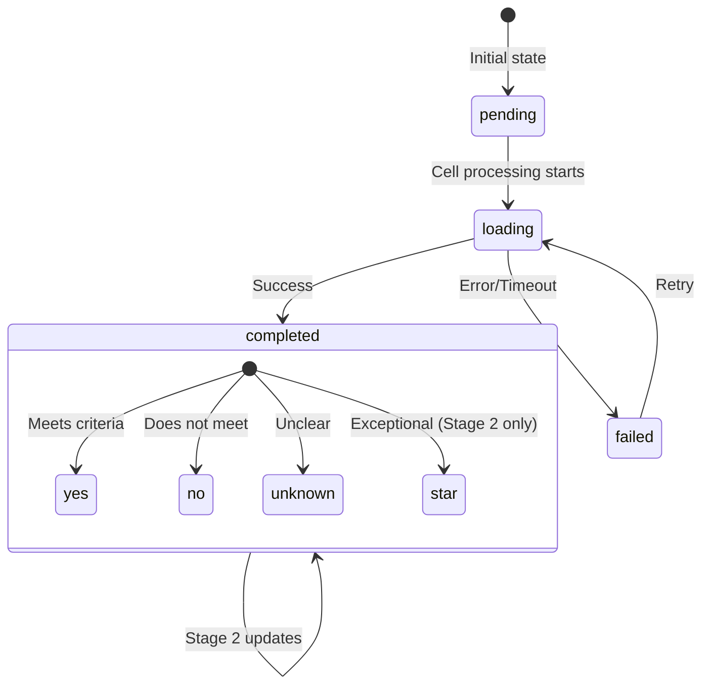
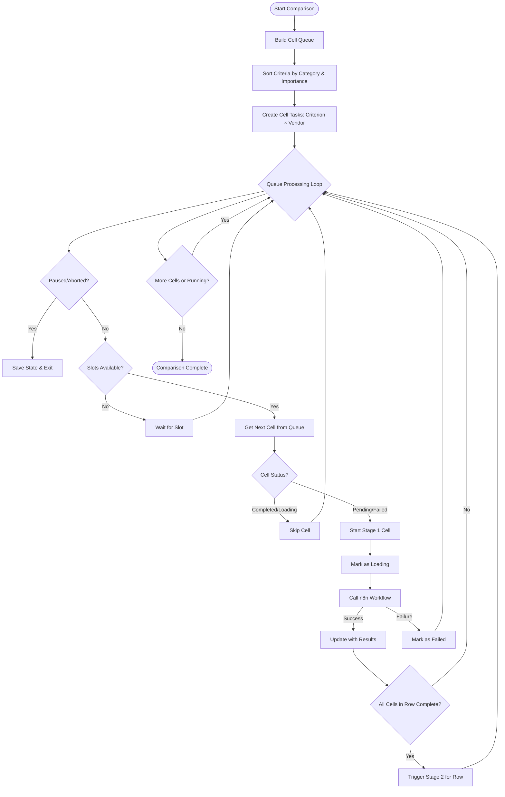
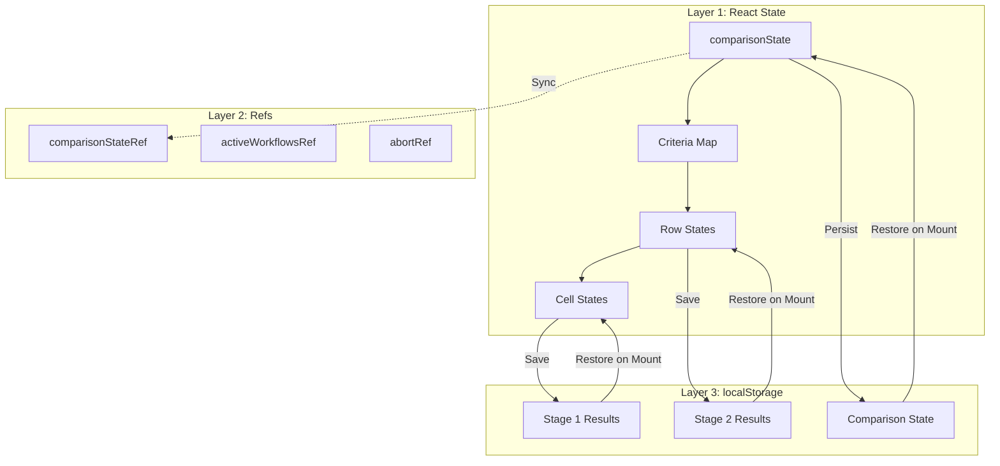
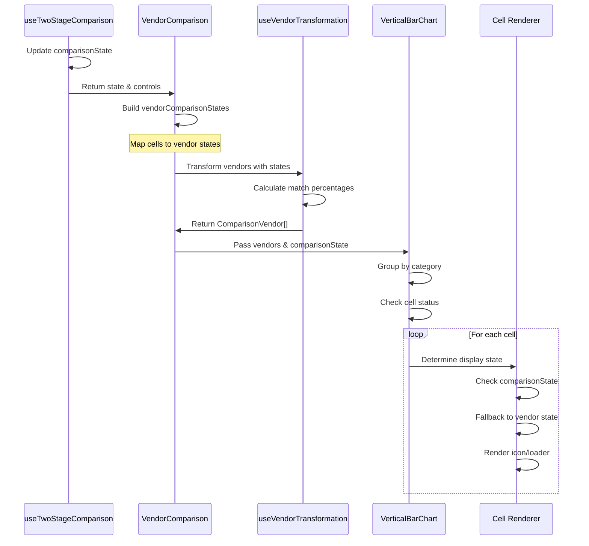
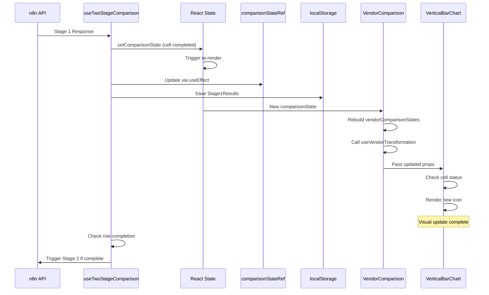
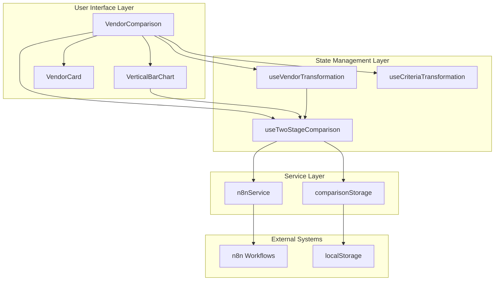

# Two-Stage Vendor Comparison System: Technical Architecture Analysis

## Executive Summary

This document provides a comprehensive technical analysis of the two-stage vendor comparison system, examining the complete lifecycle from workflow orchestration to UI rendering. The system implements a sophisticated queue-based orchestration pattern with parallel Stage 1 processing and sequential Stage 2 ranking, managing complex state transitions across React components, refs, and localStorage persistence.

## Table of Contents

1. [System Architecture Overview](#system-architecture-overview)
2. [Cell State Lifecycle](#cell-state-lifecycle)
3. [Workflow Orchestration](#workflow-orchestration)
4. [State Management Architecture](#state-management-architecture)
5. [UI Rendering Pipeline](#ui-rendering-pipeline)
6. [Race Conditions & Timing Issues](#race-conditions--timing-issues)
7. [Critical Problems Identified](#critical-problems-identified)
8. [Data Flow Analysis](#data-flow-analysis)
9. [Architectural Diagrams](#architectural-diagrams)

## System Architecture Overview

The two-stage comparison system processes vendor evaluations through two distinct phases:

- **Stage 1**: Individual vendor × criterion research (parallel, max 5 concurrent)
- **Stage 2**: Comparative ranking with star allocation (per criterion, after Stage 1 complete)

### Core Components

1. **useTwoStageComparison Hook** (`/src/hooks/useTwoStageComparison.ts`)
   - Central orchestration engine
   - Queue management and concurrency control
   - State persistence and recovery

2. **VendorComparison Component** (`/src/components/VendorComparison.tsx`)
   - Primary UI container
   - State-to-UI mapping
   - Event handling and user interactions

3. **VerticalBarChart Component** (`/src/components/vendor-comparison/VerticalBarChart.tsx`)
   - Cell rendering and visual state representation
   - Category-based grouping and accordion UI

4. **useVendorTransformation Hook** (`/src/hooks/useVendorTransformation.ts`)
   - Data transformation pipeline
   - Score calculation and vendor formatting

## Cell State Lifecycle

### State Transitions

Each cell (vendor × criterion intersection) progresses through distinct states:



### Cell State Structure

```typescript
interface CellState {
  status: 'pending' | 'loading' | 'completed' | 'failed';
  value?: 'yes' | 'no' | 'unknown' | 'star';
  evidenceUrl?: string;
  evidenceDescription?: string;
  comment?: string;
  error?: string;
  errorCode?: string; // 'TIMEOUT' | 'HTTP_400' | etc
  retryCount?: number;
}
```

## Workflow Orchestration

### Queue-Based Processing Architecture

The system implements a sophisticated queue-based orchestration pattern:



### Concurrency Management

The orchestration implements strict concurrency controls:

1. **Global Limit**: Maximum 5 concurrent Stage 1 workflows
2. **Priority Order**: Cells process top-down, left-right (criterion priority, then vendor order)
3. **Stage 2 Independence**: Stage 2 runs asynchronously without affecting Stage 1 limits

### Queue Initialization

```javascript
// Build flat cell queue: criteria × vendors
const cellQueue: CellTask[] = [];
for (let cIndex = 0; cIndex < sortedCriteria.length; cIndex++) {
  for (let vIndex = 0; vIndex < vendors.length; vIndex++) {
    cellQueue.push({
      criterionIndex: cIndex,
      vendorIndex: vIndex,
      criterion: sortedCriteria[cIndex],
      vendor: vendors[vIndex],
    });
  }
}
```

## State Management Architecture

### Three-Layer State System

The system manages state across three layers:



### State Synchronization Flow

1. **React State → Ref**: `useEffect` keeps ref in sync with state changes
2. **State → localStorage**: Every state update triggers persistence
3. **localStorage → State**: On mount, restored data rebuilds state
4. **Ref Usage**: Critical for async operations to avoid stale closures

## UI Rendering Pipeline

### Data Flow to UI



### Cell Rendering Logic

The `VerticalBarChart` component determines cell display through a hierarchical check:

```javascript
// Get cell-level status from comparisonState if available
const cellStatus = comparisonState?.criteria[criterion.id]?.cells[vendor.id]?.status;
// Fall back to vendor-level status if cell-level not available
const comparisonStatus = cellStatus || vendor.comparisonStatus;

// Render based on status
if (comparisonStatus === 'loading') {
  // Show spinner
} else if (comparisonStatus === 'pending') {
  // Show empty state
} else if (comparisonStatus === 'failed') {
  // Show retry icon
} else {
  // Show value icon (yes/no/unknown/star)
}
```

## Race Conditions & Timing Issues

### Issue 1: Stale Closure Problem

**Problem**: Async operations capture state at invocation time, leading to stale data.

```javascript
// PROBLEM: runStage1Cell captures comparisonState from closure
const runStage1Cell = useCallback(async (...) => {
  // This uses stale state if called after state updates
  const stage1Data = loadStage1Results(projectId);

  // SOLUTION: Use ref for latest state
  for (const [cid, row of Object.entries(comparisonStateRef.current.criteria)) {
    stage1Data.results[cid] = row.cells;
  }
}, [projectId, techRequest]);
```

### Issue 2: Active Workflow Counter Desynchronization

**Problem**: Counter incremented in orchestration but decremented in callback.

```javascript
// PROBLEM AREA - Lines 752-756 in useTwoStageComparison.ts
activeWorkflowsRef.current++;  // Incremented in orchestrateComparison

// But decremented in runStage1Cell finally block
finally {
  activeWorkflowsRef.current--;  // Potential mismatch if cell skipped
}
```

**Impact**: If a cell is skipped (already completed/loading), counter becomes incorrect.

### Issue 3: Stage 2 Trigger Race Condition

**Problem**: Multiple cells completing simultaneously may trigger Stage 2 multiple times.

```javascript
// ISSUE: No mutex protection
if (!criteriaStage1Triggered.has(criterion.id)) {
  const allCellsComplete = vendors.every(v => {
    const cState = comparisonStateRef.current.criteria[criterion.id]?.cells[v.id];
    return cState?.status === 'completed';
  });

  if (allCellsComplete) {
    criteriaStage1Triggered.add(criterion.id);  // Race window here
    // Another cell could complete and check before this adds
    runStage2Row(criterion.id, criterion);
  }
}
```

### Issue 4: State Update After Unmount

**Problem**: Async operations continue after component unmount.

```javascript
// MISSING: Cleanup mechanism
useEffect(() => {
  return () => {
    // Should cancel all pending operations
    abortRef.current = true;
    // But async operations don't check this consistently
  };
}, []);
```

## Critical Problems Identified

### 1. **Cell Status Persistence Gap**

**Location**: Lines 387-402 in `useTwoStageComparison.ts`

**Problem**: Stage 1 persistence saves all cells from ref, but updates with current cell afterward, potentially overwriting concurrent updates.

```javascript
// Collect all Stage 1 cells from ref
for (const [cid, row] of Object.entries(comparisonStateRef.current.criteria)) {
  stage1Data.results[cid] = row.cells;
}

// Update with latest cell - MAY OVERWRITE CONCURRENT UPDATES
stage1Data.results[criterionId] = {
  ...stage1Data.results[criterionId],
  [vendorId]: { /* new cell data */ },
};
```

**Solution Needed**: Atomic update pattern or proper merge strategy.

### 2. **Loading State Orphaning**

**Location**: Lines 202-214 in `useTwoStageComparison.ts`

**Problem**: On page refresh, "loading" cells are reset to "pending", losing progress indication.

```javascript
// Reset any "loading" cells to "pending" on restore
if (cell.status === 'loading') {
  mergedState.criteria[criterion.id].cells[vendorId] = {
    ...cell,
    status: 'pending',  // User loses visibility of what was processing
  };
}
```

**Impact**: Users can't distinguish between never-started and interrupted cells.

### 3. **Queue Position Loss**

**Location**: Line 709 in `useTwoStageComparison.ts`

**Problem**: `currentCellIndex` is persisted but criteria order may change on reload.

```javascript
let queueIndex = currentState.currentCellIndex || 0;
// But sortedCriteria order depends on current criteria array
```

**Impact**: Resume may skip cells or re-process completed ones.

### 4. **Vendor State Mapping Inefficiency**

**Location**: Lines 115-193 in `VendorComparison.tsx`

**Problem**: Complete state rebuild on every render.

```javascript
const vendorComparisonStates = useMemo(() => {
  // Entire mapping recalculated even for single cell updates
  for (const vendor of workflowVendors) {
    for (const criterion of workflowCriteria) {
      // O(v*c) operation on every state change
    }
  }
}, [workflowVendors, workflowCriteria, comparisonState]);
```

**Performance Impact**: With 10 vendors × 20 criteria = 200 iterations per state update.

### 5. **Stage 2 Error Recovery**

**Location**: Lines 613-627 in `useTwoStageComparison.ts`

**Problem**: Stage 2 failures have no automatic retry mechanism.

```javascript
catch (error: any) {
  // Mark Stage 2 as failed - NO RETRY LOGIC
  setComparisonState(prev => ({
    ...prev,
    criteria: {
      [criterionId]: {
        stage2Status: 'failed',
        stage2Error: error.message,
      },
    },
  }));
}
```

**Impact**: Single Stage 2 failure blocks criterion completion permanently.

## Data Flow Analysis

### Complete State Update Propagation



### Critical Path Latency

1. **API Response → Visual Update**: ~50-100ms
2. **State persistence**: ~10-20ms per save
3. **UI recalculation**: ~20-30ms for 200 cells
4. **Total latency**: ~80-150ms per cell update

## Architectural Diagrams

### System Component Interaction



### Stage Progression Timeline

```mermaid
gantt
    title Two-Stage Comparison Timeline
    dateFormat X
    axisFormat %s

    section Criterion 1
    V1 Research    :c1v1, 0, 3
    V2 Research    :c1v2, 0, 3
    V3 Research    :c1v3, 0, 3
    V4 Research    :c1v4, 1, 3
    V5 Research    :c1v5, 2, 3
    Stage 2 Ranking :crit, c1s2, 5, 2

    section Criterion 2
    V1 Research    :c2v1, 3, 3
    V2 Research    :c2v2, 4, 3
    V3 Research    :c2v3, 5, 3
    V4 Research    :c2v4, 6, 3
    V5 Research    :c2v5, 6, 3
    Stage 2 Ranking :c2s2, 9, 2

    section Criterion 3
    V1 Research    :c3v1, 7, 3
    V2 Research    :c3v2, 8, 3
    V3 Research    :c3v3, 9, 3
    V4 Research    :c3v4, 9, 3
    V5 Research    :c3v5, 10, 3
    Stage 2 Ranking :c3s2, 13, 2
```



## Recommendations

### Immediate Fixes Required

1. **Fix Active Workflow Counter**
   - Move increment/decrement to same scope
   - Add validation checks

2. **Implement Stage 2 Mutex**
   - Prevent duplicate Stage 2 triggers
   - Use Promise-based locking

3. **Add Cleanup on Unmount**
   - Cancel all pending API calls
   - Clear timeouts and intervals

4. **Optimize State Mapping**
   - Implement selective updates
   - Use memoization for unchanged cells

### Architecture Improvements

1. **Implement Event-Driven Updates**
   - Replace polling with event emitters
   - Reduce unnecessary re-renders

2. **Add State Machine Pattern**
   - Formalize state transitions
   - Prevent invalid state combinations

3. **Implement Retry Queue**
   - Automatic exponential backoff
   - Configurable retry limits

4. **Add Performance Monitoring**
   - Track operation latencies
   - Monitor memory usage
   - Log state update frequencies

## Conclusion

The two-stage vendor comparison system implements a sophisticated orchestration pattern with complex state management across multiple layers. While the architecture successfully handles concurrent operations and state persistence, several critical issues around race conditions, state synchronization, and error recovery need immediate attention. The identified problems are solvable with targeted fixes, and the overall architecture provides a solid foundation for scalable vendor comparison operations.

The system's strength lies in its queue-based orchestration and progressive loading approach, but improvements in state management efficiency and error handling robustness would significantly enhance reliability and performance.